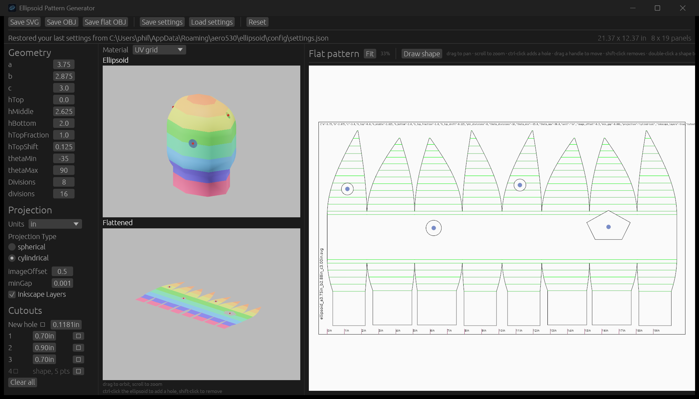
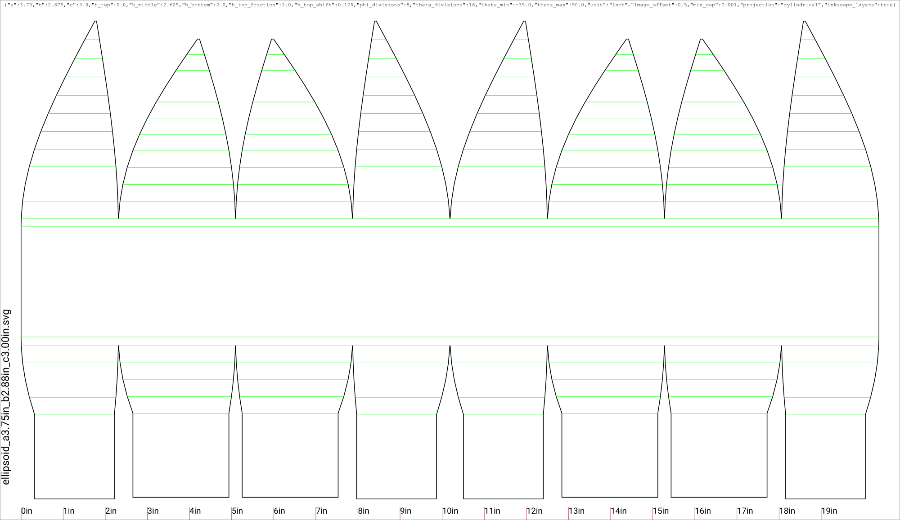
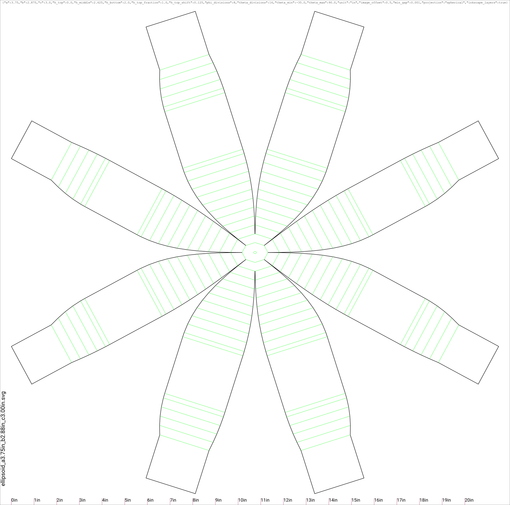
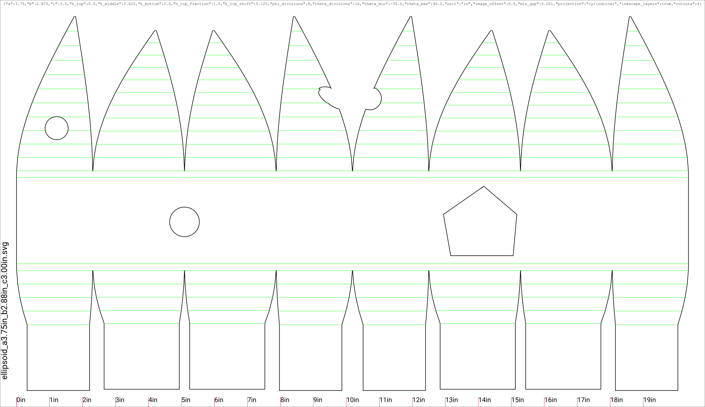

# Ellipsoid Pattern Generator

**[Live Demo](https://aero530.github.io/ellipsoid/)**

Generate an SVG flat pattern of a general ellipsoid. Originally built to cut helmet shells out of foam on a laser cutter.

Give it three semi-axes and a few options; it unrolls the surface into panels you can print, cut, and glue back into the shape.



Unroll **cylindrically**, into vertical gores from the front:



…or **spherically**, into petals from the top:



Cutouts are subtracted from the pattern. One that reaches a panel edge opens it, so the two halves form the shape once the panels are joined — here the hole on the seam left facing scallops on the two petals that meet there:



## Features

- Arbitrary ellipsoid shape, with an open top or bottom
- Extra height inserted at the centre, top, or bottom
- Any number of horizontal and vertical divisions
- Units in mm, cm, or inches
- Unroll **spherically** (from the top, into petals) or **cylindrically** (from the front, into vertical gores)
- Live 2D preview of the pattern, plus 3D views of the ellipsoid and the flattened panels
- **Cutouts** — round holes and free-form shapes, placed on the 3D surface or drawn directly on the pattern. They are subtracted from the pattern, and a cutout crossing a seam opens that edge so the two panels form the shape once joined
- Dart lines for folding and glue alignment
- A printed ruler, to check the scale came out right
- Inkscape layer support
- Exports SVG, and OBJ meshes of both the surface and the flattened pattern

## Install

Download an installer or archive from [Releases](https://github.com/aero530/ellipsoid/releases).

| Platform | |
| --- | --- |
| Windows | `Ellipsoid-<version>-x64.msi` |
| macOS, Linux | `curl --proto '=https' --tlsv1.2 -LsSf https://github.com/aero530/ellipsoid/releases/latest/download/ellipsoid-app-installer.sh \| sh` |
| Any | the `.tar.xz` / `.zip` archive for your platform |

The Windows installer carries **both** the app and the `ellipsoid` command-line tool, installs
for the current user only — into `%LOCALAPPDATA%\Programs\Ellipsoid`, so it never asks for
administrator rights — adds itself to your PATH, and puts the app in the Start Menu. Uninstall
from Settings › Apps. On the other platforms the command-line tool ships separately, as
`ellipsoid-cli-*`.

Nothing is code-signed, so Windows SmartScreen warns the first time you run the installer:
**More info › Run anyway**.

There is also a **[web demo](https://aero530.github.io/ellipsoid/)** — the same app compiled to WebAssembly. It is a demo rather than the recommended way to use this: the download is several megabytes, and it can only save to your downloads folder.

## Using the pattern view

Cutouts are edited directly on the flat pattern:

| Gesture | |
| --- | --- |
| drag empty space, scroll | pan, zoom |
| ctrl-click | add a hole |
| drag a handle | move that cutout |
| shift-click a handle | remove it |
| **Draw shape**, then click | place the points of a free-form cutout — Enter finishes, Escape cancels, Backspace undoes a point |
| double-click a shape | edit its points: drag to move one, ctrl-click an edge to insert one, shift-click to remove one |

The 3D ellipsoid view takes ctrl-click to add a hole and shift-click to remove one. The **Material** dropdown above the two views switches them between plain colour and a UV grid; because both views use the same surface coordinates, the grid lands identically on the ellipsoid and the flattened panels, so a spot on the shell can be found on the pattern by eye.

Settings are remembered between sessions, and can be saved to and loaded from JSON.

## Command line

`ellipsoid` renders patterns without a GUI, for scripting or batch work.

```sh
# Defaults, straight to SVG
ellipsoid -o helmet.svg

# Override individual parameters
ellipsoid -o helmet.svg --a 4.0 --b 3.0 --c 3.25 --projection spherical

# Start from a settings file written by the GUI, then adjust
ellipsoid -o helmet.svg --config helmet.json --divisions-theta 24

# Meshes, and the resolved parameters
ellipsoid --format obj      -o helmet.obj
ellipsoid --format obj-flat -o helmet-flat.obj
ellipsoid --format config   -o resolved.json
```

Output goes to stdout by default, so it pipes. `ellipsoid --help` lists every parameter; they are the ones the GUI shows, and the JSON is the same format both read and write.

## Building

Rust only — no Node, and no system toolchain beyond a linker plus, on Linux, Bevy's dependencies. The toolchain is pinned in [rust-toolchain.toml](rust-toolchain.toml), so `rustup` fetches the right one on the first `cargo` command.

```sh
cargo run -p ellipsoid-app          # desktop GUI
cargo run -p ellipsoid-cli -- --help
cargo test --workspace
```

On Debian/Ubuntu, Bevy needs:

```sh
sudo apt-get install libasound2-dev libudev-dev libwayland-dev libxkbcommon-dev
```

For the web build:

```sh
cargo install trunk
trunk serve                          # http://127.0.0.1:8080
```

For the Windows installer — WiX is downloaded, checksummed and unpacked under `target/`, so
nothing is installed system-wide and no administrator rights are needed:

```powershell
.\installer\build.ps1                 # target/installer/Ellipsoid-<version>-x64.msi
.\installer\verify.ps1                # installs it, runs it, uninstalls it, checks the cleanup
```

## Layout

| Crate | |
| --- | --- |
| [`ellipsoid-core`](crates/ellipsoid-core) | Geometry, unrolling, surface coordinates, OBJ. No UI, no I/O; `f64` throughout |
| [`ellipsoid-pattern`](crates/ellipsoid-pattern) | 2D scene model, page layout, cutout subtraction, SVG output |
| [`ellipsoid-app`](crates/ellipsoid-app) | Bevy + egui GUI — one binary for both desktop and web |
| [`ellipsoid-cli`](crates/ellipsoid-cli) | Headless renderer |

[`golden/`](golden) holds snapshots of the geometry and the SVG across a parameter matrix chosen to hit the branches rather than the defaults. They are regression fixtures, regenerated deliberately with `UPDATE_GOLDEN=1 cargo test` after reading the diff. Alongside them, `tests/invariants.rs` checks properties the output must have — chiefly that unrolling preserves lengths — which is what says the numbers are *right* rather than merely unchanged. [`golden/README.md`](golden/README.md) explains the file format, the naming, and which test reads what.

The core math is `f64` because the port was validated against the JavaScript at a `1e-9` relative tolerance, which `f32` cannot reach.

## License

MIT. See [LICENSE](LICENSE).
