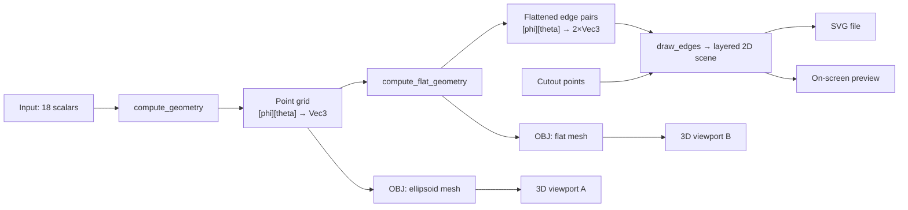

# Rust Conversion Plan — Ellipsoid Pattern Generator

Converting the Electron/React/Redux app to a single Rust codebase that ships as a native desktop app, a web demo, and a headless CLI from one source tree.

**Stack: Bevy (3D) + `bevy_egui` (all UI), plus a `clap` CLI. `cargo run` for desktop, `trunk serve` for web, `ellipsoid-cli` for batch.**

> **The conversion is complete.** This document is now a record of how it went: the phase list below is what was planned, and Appendices A–N are what actually happened, including the deviations and the things that went wrong.
>
> Paths like `app/utils/ellipsoid.js` and `package.json` refer to the original implementation, deleted in Phase 9. They are in git at the tag **`js-final`** — `git show js-final:app/utils/ellipsoid.js`.

---

## 1. Executive summary

The app is ~3,300 lines of JavaScript, of which roughly **1,000 lines are pure geometry math** and the rest is UI plumbing, Electron boilerplate, and two 3D viewport wrappers. The math is the valuable part and it ports to Rust almost mechanically. The UI is worth rewriting rather than translating — Redux + Material-UI has no meaningful Rust analogue, and the state model (18 scalar inputs → derived geometry) collapses into a single struct with immediate-mode UI.

Three things drive the plan:

1. **The flattening math has subtle, undocumented special cases** (sign flips at `hTop`/`hBottom` boundaries, the `indexWide` pivot in cylindrical mode). Silent numerical divergence is the #1 project risk. Mitigation: a golden-file parity harness built in Phase 1, before any UI work.
2. **paper.js is not a real dependency.** The app uses 13 paper.js symbols and needs none of the library's actual power (boolean ops, curve math, hit-testing). It's a scene graph + SVG serializer. That's ~300 lines of Rust, not a crate hunt.
3. **Cutout points become a real feature, not a stub.** Making picked 3D points cut actual holes in the flat pattern is the one piece of genuinely new design in this conversion. It gets its own phase (§6, Phase 6) and its own section (§7.3).

Estimated effort: **7–9 focused working days** to feature parity plus working cutouts. Phases 1, 2, and 6 are the substantive work; the rest is assembly.

---

## 2. What the current app actually does

### Source inventory

| File | Lines | Role | Disposition |
|---|---:|---|---|
| `app/utils/ellipsoid.js` | 886 | Geometry, flattening, pattern drawing, OBJ, notes | **Port carefully — split into 3 modules** |
| `app/components/three3D.js` | 399 | three.js viewport, OBJ round-trip, orbit, raycast picking | Rewrite in Bevy |
| `app/menu.js` | 275 | Electron menu — near-verbatim boilerplate, no app actions | **Delete** (add a small egui menu bar) |
| `app/components/ellipsoidInput.js` | 315 | 11 MUI number fields + unit select | Collapse to ~40 lines of egui |
| `app/components/scene.js` | 195 | paper.js canvas + SVG download + recompute-on-update | Rewrite |
| `app/components/projectionInput.js` | 148 | 2 fields, radio group, switch | Collapse to ~15 lines of egui |
| `app/utils/geometryHelpers.js` | 132 | `distance`, `rotatePoint`, `planeNormal`, `angleBetweenPlanes` | **Port — mostly replaced by `glam`** |
| `app/components/texture.js` | 125 | Perspective-map an SVG texture onto panels | **Deferred** — dead code today (see §7.4) |
| `app/components/view3D.js` | 127 | vis.js 3D — superseded by three3D.js | **Delete** |
| `app/components/Home.js` | 126 | MUI grid layout | Rewrite as egui panels |
| reducers/, actions/, store/, containers/, Routes | ~180 | Redux + router (single route) | **Delete** — replaced by one struct |
| `app/main.dev.js` | 103 | Electron main process | **Delete** |

### The computation pipeline



Every input change re-runs the whole pipeline. At the default 8×16 divisions that's a few thousand point rotations — sub-millisecond in Rust, so **recompute-on-change with no caching is fine**. Add memoization only if divisions go above ~100×100.

### Behavior worth preserving explicitly

- Theta array is forced to include exactly `0.0` when the range spans zero.
- `hMiddle` duplicates the equator row and splits the ellipsoid vertically.
- `hTop` / `hBottom` append scaled/shifted rows at the poles.
- `thetaMin == -90` and `thetaMax == 90` are clamped to ±89° to avoid degenerate poles.
- `hMiddle == 0` becomes `0.001` because cylindrical projection divides by it.
- SVG layer names are load-bearing: `Ellipsoid Pattern`, `Bounding Box`, `Guide Lines`, `Edges Destination Quadrilaterals`, `Edges Source Quadrilaterals`, `Notes`. The two quadrilateral layers are built then immediately removed in the preview path, but the cutout feature (§7.3) needs exactly this data — keep generating them.
- Inkscape export rewrites `<g id="X">` → `<g inkscape:groupmode="layer" id="X">`.
- The `minGap` filter drops points closer than the threshold, so the cut path merges adjacent panels.

---

## 3. Target architecture

### Workspace layout

```
ellipsoid/
├── Cargo.toml                  # workspace
├── crates/
│   ├── ellipsoid-core/         # pure math, zero UI/IO deps
│   │   ├── src/
│   │   │   ├── lib.rs
│   │   │   ├── input.rs        # EllipsoidInput + defaults + validation
│   │   │   ├── geometry.rs     # compute_geometry
│   │   │   ├── flatten.rs      # compute_flat_geometry (spherical + cylindrical)
│   │   │   ├── rotate.rs       # rotate_point, angle_between_planes
│   │   │   ├── surface.rs      # SurfacePoint, tri↔grid mapping (§7.3)
│   │   │   ├── obj.rs          # OBJ writer
│   │   │   └── units.rs        # Unit enum (replaces ppu float matching)
│   │   └── tests/
│   │       └── parity.rs       # geometry, flattening, OBJ vs JS
│   ├── ellipsoid-pattern/      # 2D scene model + SVG emitter
│   │   ├── src/
│   │   │   ├── scene.rs        # Layer/Path/Text/Color, bounds
│   │   │   ├── layout.rs       # port of draw_edges + draw_notes
│   │   │   ├── cutouts.rs      # cutout point → flat pattern holes (§7.3)
│   │   │   └── svg.rs          # serializer + Inkscape mode
│   │   └── tests/
│   │       ├── layout_parity.rs   # drawEdges vs JS
│   │       └── svg_document.rs    # document structure
│   ├── ellipsoid-cli/          # headless: clap → SVG/OBJ
│   │   └── src/main.rs
│   └── ellipsoid-app/          # the GUI (bin target, desktop + wasm)
│       ├── src/
│       │   ├── main.rs         # runs on desktop AND wasm
│       │   ├── state.rs        # AppState + recompute
│       │   ├── ui.rs           # toolbar, settings, preview area, status
│       │   ├── preview.rs      # Scene -> egui painter, pan/zoom
│       │   ├── viewport.rs     # Bevy render-to-texture cameras (Phase 5)
│       │   ├── picking.rs      # cutout point placement (Phase 6)
│       │   └── platform.rs     # save_text: native (rfd) vs web (Blob)
│       ├── index.html          # trunk entry
│       └── assets/
├── golden/*.json               # JS reference fixtures, shared by both crates
├── tools/extract-golden.mjs    # regenerates them from app/utils/*.js
├── Trunk.toml
└── .github/workflows/ci.yml
```

**Why `ellipsoid-core` has no UI dependencies:** it stays testable without a window and is directly reusable by the CLI. Depend only on `glam` and `serde`.

**Why one binary target for desktop + web:** Bevy and `trunk` both build the same `main.rs`; `#[cfg(target_arch = "wasm32")]` covers the ~50 lines that differ (file save, window config, storage).

### State model

Redux's three slices (`input`, `geometry`, `edges`) become one Bevy resource. Only `input` and `cutouts` are real state; the rest is derived and should never be stored as independent truth:

```rust
#[derive(Resource)]
struct AppState {
    input: EllipsoidInput,        // authoritative; serde-serializable
    cutouts: Vec<Cutout>,         // authoritative; stored in stable surface coords (§7.3)
    derived: Option<Derived>,     // recomputed whenever input or cutouts change
    dirty: bool,
}

struct Derived {
    geometry: Geometry,           // point grid + indices
    flat: FlatGeometry,
    scene: pattern::Scene,        // 2D layered scene, ready to draw or serialize
    mesh_3d: Handle<Mesh>,
    mesh_flat: Handle<Mesh>,
}
```

A single `recompute` system runs when `dirty`, replacing the `componentDidUpdate` recompute in `scene.js:48-57`.

### Naming cleanup (do this during the port, not after)

The JS distinguishes `Divisions` from `divisions` by capitalization alone — a latent bug factory that Rust's lint rules will reject anyway.

| JS | Rust | Meaning |
|---|---|---|
| `Divisions` | `phi_divisions` | longitudinal, around the circumference |
| `divisions` | `theta_divisions` | latitudinal, pole to pole |
| `indexP` / `indexT` | `ip` / `it` | loop indices |
| `indexWide` | `widest_row` | index of the widest theta row |
| `ppu` (96 / 3.7795276 / 37.795276) | `Unit` enum with `px_per_unit()` | replaces float equality matching |

`getUnits()` at `ellipsoid.js:875-886` compares floats with `===` and returns `null` on miss. A `Unit { Inch, Mm, Cm }` enum makes that unrepresentable.

---

## 4. UI stack

**Bevy + `bevy_egui`.** Bevy owns the 3D scenes; egui owns every widget, panel, and the 2D pattern preview. The two 3D viewports render to `Image` textures displayed inside egui panels, so **egui drives all layout** and you get resizable panes for free — which is what `commit 6fc54ab "resizable pane for svg image"` was reaching for.

Why this fits:

- One rendering stack for desktop and web; wasm support is first-party.
- Bevy's built-in picking (`bevy_picking`, in core since 0.15) directly replaces the hand-rolled raycaster at `three3D.js:279-330`, and — importantly — its `RayMeshHit` returns triangle index and barycentric coordinates, which is exactly the input the cutout mapping needs (§7.3). Doing that against a hand-rolled raycaster would mean reimplementing the same bookkeeping.
- egui's immediate mode removes the entire Redux layer. `ui.add(DragValue::new(&mut input.a).speed(0.125))` replaces a 40-line MUI `TextField` + action + reducer round-trip.
- Two independent 3D views is trivially two cameras with two render targets.

Known costs, accepted:

- **Bundle size.** Bevy's wasm output is large — realistically **10–20 MB uncompressed, 4–7 MB brotli** even with default plugins trimmed. Since the web build is a demo, this is fine. Still do the cheap wins (trim default features, `wasm-opt -Oz`, brotli at the server, a loading indicator) but don't let size drive design.
- **Version churn.** `bevy_egui`, `bevy_panorbit_camera`, and Bevy itself must agree on the Bevy minor version. Pin all three exactly and upgrade them as a unit. This is the most likely source of friction during the build.

*(`eframe` + `three-d` would be a much smaller wasm bundle, but it was ruled out: web is a demo, and Bevy's picking is worth real money for the cutout feature.)*

---

## 5. Dependency map

| Current (JS) | Rust replacement | Notes |
|---|---|---|
| React + Redux + MUI | `bevy_egui` | ~600 lines of UI collapse to ~150 |
| three.js + OrbitControls | `bevy` + `bevy_panorbit_camera` | Pin to Bevy minor |
| three.js Raycaster | `bevy_picking` (core) | Gives triangle index + barycentric, needed by §7.3 |
| paper.js | **hand-written** (`ellipsoid-pattern`) | 13 symbols used; see §7.1 |
| OBJLoader round-trip | *(removed)* | Build `Mesh` from the point grid directly |
| `lodash.clonedeep` | `#[derive(Clone)]` | — |
| `vis` (view3D.js) | *(deleted)* | Already superseded |
| `perspective-transform` | *(not needed)* | Barycentric mapping replaces it, §7.3 |
| Electron shell | `winit` (via Bevy) | — |
| `electron-builder` | `cargo-dist` | MSI/NSIS + dmg + AppImage |
| DOM anchor download | `rfd` (native) / `web-sys` Blob (web) | Behind one trait, §7.5 |
| webpack dev server | `trunk serve` | — |
| eslint / prettier | `clippy` / `rustfmt` | — |
| *(none)* | `clap` | New: headless CLI |

New crates: `glam` (math, shared with Bevy), `serde` + `serde_json` (state, golden files, cutout persistence), `svg` or plain `std::fmt::Write` (emitter), `ab_glyph` (text metrics, §7.2), `thiserror`, `directories` (native config path), `clap` (CLI), `i_overlay` (2D boolean ops — Phase 6b only, §7.3).

Optional: `resvg` + `tiny-skia` (exact-fidelity preview), `lyon` (concave polygon fill in preview).

---

## 6. Phased plan

### Phase 0 — Scaffold *(0.5 day)*

1. Create the workspace, four crates, CI (fmt + clippy + test on Linux/Windows, plus a wasm build).
2. Hello-world: Bevy + `bevy_egui` with one cube, one egui panel, `bevy_panorbit_camera`, building for both desktop and `trunk build --release`.
3. Pin `bevy`, `bevy_egui`, `bevy_panorbit_camera` to exactly compatible versions and record them in the README. Trim Bevy default features (drop audio, gltf, scene, sprite, gizmos); set `opt-level = "z"`, `lto = "fat"`, `codegen-units = 1`, `panic = "abort"` in the release profile; run `wasm-opt -Oz`.

**Exit criteria:** desktop window and browser tab both render the cube with a working egui panel; CI green on both targets.

### Phase 1 — Core math + parity harness *(1.5–2 days)* ← highest risk, do it first

1. Write the JS golden-data extractor **before** writing Rust. A small Node script that imports the existing `computeGeometry` / `computeFlatGeometry` and dumps JSON for a parameter matrix (`tests/golden/`). The functions are ES modules with a stray `import { settings } from 'paper'` at `ellipsoid.js:10` that is never used — delete that line and the module loads cleanly under `node --experimental-vm-modules` or a two-line esbuild step.
2. Choose the matrix to cover the branchy cases, not just the defaults:
   - both projections × {`thetaMin=-90`, `-35`, `0`, `+30`} × {`thetaMax=90`, `45`, `0`, `-20`}
   - `hTop`, `hMiddle`, `hBottom` each zero and non-zero, and all three together
   - `hTopFraction != 1.0`, `hTopShift != 0`
   - odd and even `phi_divisions`; `theta_divisions` at the minimum of 3
   - a degenerate case: `a == b` (sphere of revolution)
3. Port `rotate.rs` first and unit-test it standalone — `rotate_point` at `geometryHelpers.js:27-101` is Rodrigues' rotation and is the numerical foundation of everything else. `glam::Quat::from_axis_angle` gives the same result; verify against the hand-rolled matrix before trusting it.
4. Port `compute_geometry`, then `compute_flat_geometry`, **bug-for-bug faithful** (see §8 — this is a deliberate decision, including the `thetaMax` bug).
5. Parity test: compare every point within `1e-9` relative tolerance.

**Exit criteria:** every golden case passes. Do not proceed until green — everything downstream inherits these numbers.

### Phase 2 — 2D scene model, SVG export, OBJ export *(1–1.5 days)*

1. Build the minimal scene graph (§7.1) with `bounds()` on every item.
2. Port `draw_edges` — the point-ordering loops at `ellipsoid.js:595-671` are the fiddly part (the `minGap` filter and the forward/reverse traversal that produces the cut outline).
3. Port `draw_notes` including the ruler and the rotated filename label (`ellipsoid.js:818-873`).
4. SVG serializer + Inkscape layer mode. Emit deterministic output (fixed decimal precision, stable attribute order) so exports are diffable.
5. Port the OBJ writers.
6. **Golden-file test the SVG output** against files exported from the running JS app. Compare parsed path data numerically rather than byte-for-byte — attribute ordering and float formatting will legitimately differ.

**Exit criteria:** an SVG exported by the Rust code opens in Inkscape with correct layers, and its path geometry matches the JS export within tolerance.

### Phase 3 — Headless CLI *(0.5 day)* — complete, see Appendix D

Lands here deliberately: it makes the whole pipeline usable end-to-end before a single pixel of UI exists, and it gives you a scriptable way to bulk-generate SVGs for diffing against JS output.

**Status: complete**, apart from `--cutouts`, which needs Phase 6. Argument parsing and `--config` merging landed in Phase 0; the output formats landed in Phase 2, because rendering a real file was the only honest way to verify the SVG export. Phase 3 added validation, the `--no-inkscape-layers` negation, grouped help with worked examples, and 14 end-to-end tests.

```
ellipsoid --a 3.75 --b 2.875 --c 3 \
          --theta-min -35 --theta-max 90 \
          --h-middle 2 --h-bottom 2 \
          --divisions-phi 8 --divisions-theta 16 \
          --projection cylindrical --units in \
          --inkscape-layers \
          -o pattern.svg
```

- `--format svg|obj|obj-flat`, `-o -` writes to stdout.
- `--config settings.json` loads a saved `EllipsoidInput`; CLI flags override individual fields.
- `--cutouts cutouts.json` for batch runs once Phase 6 lands.
- Derive the whole arg struct from `EllipsoidInput` with `clap`'s derive API so adding a parameter touches one place.

**Exit criteria:** CLI reproduces the Phase 2 golden SVGs; `--help` documents every parameter using the tooltip text from the existing UI.

### Phase 4 — egui shell and state *(1 day)* — complete, see Appendix E

1. `AppState` resource, `EllipsoidInput` with serde and the current defaults from `reducers/input.js`.
2. Left side panel: all inputs. Use `DragValue` with `.speed()` and `.range()` mirroring the existing `min`/`max`/`step` props, `ComboBox` for units, radio for projection, checkbox for Inkscape layers. Keep the existing tooltip text verbatim — it's genuinely useful documentation of the parameters.
3. Central panel: 2D pattern preview with pan/zoom (see §7.2 for the fill caveat).
4. `recompute` system gated on `dirty`.
5. Menu bar: Save SVG, Save OBJ, Save/Load settings, Reset to defaults.

**Exit criteria:** editing any parameter updates the preview live; SVG export from the UI matches the CLI output.

### Phase 5 — 3D viewports *(1 day)*

1. Build `Mesh` directly from the point grid — quads → two triangles, with normals. **Skip the OBJ→parse→mesh round-trip** the JS does at `three3D.js:207-231`; it exists only because three.js had a loader handy. Keep the triangle emission order fixed and documented — §7.3 depends on `triangle_index → (ip, it)` being derivable.
2. Two cameras, each rendering to an `Image`; display via `egui::Image` in resizable panels.
3. `bevy_panorbit_camera` per view. Route input with its `ActiveCameraData` resource, which exists precisely to override which camera instance receives input — see the crate's `render_to_texture.rs` and `multiple_viewports.rs` examples, which together are almost exactly this use case. Set it from the hovered egui image rect.
4. Port the auto-fit-camera-to-bounds logic from `three3D.js:232-256` (bounding sphere → orthographic frustum).
5. Lighting: three spot lights + ambient, matching `three3D.js:60-104`. Add the axes helper.

**Exit criteria:** both viewports render, orbit independently, and refit when parameters change.

### Phase 6 — Cutouts *(1.5–2 days)* — complete, see Appendices G and H

Full design in §7.3. Split into two shippable steps:

**6a — Picking, stable storage, unclipped holes**
1. `bevy_picking` observers on the ellipsoid mesh: ctrl-click adds a cutout, shift-click on an existing marker removes it (preserving the interaction from `three3D.js:296-330`).
2. Convert the hit to a **stable surface coordinate** (§7.3) so cutouts survive changes to `divisions` and to the ellipsoid shape.
3. Map to flat-pattern space via the corresponding triangle; emit circles on a new `Cutouts` SVG layer.
4. Markers rendered in both 3D viewports (on the ellipsoid and on the flat mesh).
5. UI: hole diameter, a list of cutouts with per-item delete, clear-all. Cutouts serialize with the settings file.

**6b — Panel-boundary clipping** *(done — see Appendices H and I)*
6. Intersect each hole with its panel strip so one straddling a cut edge splits across two pieces instead of spanning a seam.
7. Warn in 6a (before clipping exists) when a hole crosses a panel boundary.

**Exit criteria:** a hole placed in the 3D view appears at the geometrically corresponding location in the flat pattern and in the exported SVG; holes survive a change to `divisions`; a hole placed across a seam splits into two correct pieces.

### Phase 7 — Platform I/O *(0.5 day)* — complete, see Appendix L

Saving landed in Phase 4 (`platform::save_text`, native via `rfd` and web via a `Blob` download). Phase 7 added loading and cross-session persistence: native → `directories::ProjectDirs` config path, web → `localStorage`.

### Phase 8 — Packaging and deployment *(0.5 day)*

*Complete — see Appendix M, which records where this list met what `cargo-dist` actually builds.*

- **Desktop:** `cargo-dist` → MSI + NSIS (Windows), `.dmg` (macOS), AppImage/deb (Linux), wired to GitHub Releases. This replaces the `electron-builder` block in `package.json`. Reuse the existing icons in [resources/](resources/). New app ID — proposed `io.github.aero530.ellipsoid` (see §12.5).
- **Web:** `trunk build --release` → GitHub Pages via Actions. Serve with brotli. Add a loading indicator with a progress bar — a multi-megabyte wasm download needs one, and it's a demo, so first impressions are the whole point.
- **CLI:** ship as a separate binary in the same release archives.
- Replace `.travis.yml` and `appveyor.yml` with a single GitHub Actions workflow.

### Phase 9 — Retire the JavaScript *(0.25 day)*

Delete `app/`, `configs/`, `internals/`, `package.json`, `yarn.lock`, `babel.config.js`, `.eslintrc`, `.stylelintrc`, `.prettierrc`. Keep `resources/`, `screenshots/`, `LICENSE`. Rewrite `README.md` for the Rust toolchain — it ships inside every release archive, so it is a deliverable, not just documentation.

`.travis.yml` and `appveyor.yml` went in Phase 8.

**Do this only after Phase 2's golden files are committed** — the JS is the reference implementation until then. Tag the final JS commit (`js-final`) before deletion.

---

## 7. The hard parts

### 7.1 Replacing paper.js

Full inventory of what the app uses: `Point`, `Color`, `Layer`, `Path`, `PointText`, `Shape.Rectangle`, `Group`, `project.layers[...]`, `view.zoom`, `view.center`, `exportSVG`. Plus `CompoundPath` in the dead texture module.

None of paper.js's real capabilities (curve intersection, boolean ops, hit testing, smoothing) are used in the live code path. The replacement is a plain data model:

```rust
pub struct Scene { pub layers: Vec<Layer> }
pub struct Layer { pub name: String, pub items: Vec<Item> }

pub enum Item {
    Path { points: Vec<Vec2>, closed: bool, stroke: Option<Stroke>, fill: Option<Color> },
    Rect { min: Vec2, max: Vec2, stroke: Option<Stroke>, fill: Option<Color> },
    Text { origin: Vec2, content: String, size: f32, font: FontId,
           rotation_deg: f32, anchor: Anchor, fill: Color },
}
```

with `fn bounds(&self) -> Rect` on `Item` and `Layer`. Roughly 300 lines including the SVG serializer. Writing it is less work than evaluating candidate crates, and it produces exactly the layer structure the Inkscape export depends on.

### 7.2 Text metrics and preview fidelity

Two places need real text measurement, both in `draw_notes`:

- The rotated filename label positions itself using `textFilename.bounds` (`ellipsoid.js:835-837`).
- The ruler needs the pattern layer's width in units.

Use `ab_glyph` with an embedded font to compute advance widths. The repo already ships `app/roboto-mono.woff` — you'll want the `.ttf` since WOFF needs decompression. Embedding the font also makes SVG output byte-stable across machines, which the current version is not.

**Preview rendering caveat:** the pattern outline is a large, concave, possibly self-intersecting closed path. egui cannot fill arbitrary concave polygons directly.

- **Recommended:** render the preview **stroke-only** with `egui::Painter`. For a laser-cut pattern this is arguably the better view anyway, and it's fast and crisp at any zoom.
- If the translucent white fill matters, tessellate with `lyon` into an `egui::Mesh`.
- If exact "what you'll get" fidelity matters, add an optional toggle that rasterizes the exported SVG with `resvg` into a texture. Keep this off the hot path.

### 7.3 Cutouts — 3D picks that cut real holes

This is the one part of the conversion with no JS reference to port. The existing code places marker spheres and does nothing with them (`three3D.js:318-326`); making them functional is new design.

**The mapping is exact and needs no homography.** The 3D mesh and the flat mesh share a topology: both are `phi_divisions × theta_divisions` quads, each split into the same two triangles in the same order. So a hit on 3D triangle *k* with barycentric weights (λ₀, λ₁, λ₂) maps to the identical barycentric position on flat triangle *k*. The map is piecewise-affine, defined by the triangulation itself.

```
pick → RayMeshHit { triangle_index: k, barycentric: λ }
     → quad (ip, it) = (k / 2 / theta_divisions, (k / 2) % theta_divisions)
     → flat position = λ₀·F[k].0 + λ₁·F[k].1 + λ₂·F[k].2
```

This is strictly better than the per-quad perspective transform `texture.js` uses — no inverse bilinear solve, no 8-parameter fit, no degenerate-quad edge cases. It requires only that mesh generation emit triangles in a fixed, documented order (Phase 5, step 1).

**Storage must be resolution-independent.** Storing `(triangle_index, barycentric)` breaks the moment `divisions` changes — the hole would jump. Store normalized surface coordinates instead:

```rust
struct Cutout {
    u: f64,        // [0,1) around phi — wraps
    v: f64,        // [0,1] bottom to top, by ARC LENGTH
    diameter: f64, // in current units
}
```

Derive `(u, v)` from the pick by combining the quad indices with the in-quad barycentric position, and re-derive triangle + barycentric on every recompute. A hole then stays at the same relative place on the surface when you re-tessellate. Note this means changing `a`/`b`/`c` moves holes in absolute space but keeps them in the same surface location — document that as the intended semantics, since the alternative (absolute 3D anchoring) leaves holes floating off the surface when the shape changes.

**`v` must be arc length, not an index fraction** — discovered in Phase 6a, and not obvious. `compute_geometry` inserts up to three extra theta rows (the equator, the `h_middle` split, the `h_bottom` ring) whose *count* is fixed regardless of `theta_divisions`. Their share of the index range therefore shrinks as the division count grows, sliding everything above them: a hole at index-fraction `v = 0.6` drifted ~0.3 units when `theta_divisions` went 16 → 48. Measuring `v` along the surface profile removes the dependency entirely.

**Hole size.** Panel unrolling is approximately isometric — that's the entire point of the flattening — so lengths are near-preserved and a circle of diameter *d* in flat space is a circle of diameter *d* on the finished object. Emit a polygonized circle (say 64 segments) in flat space around the mapped center. No surface-space tessellation needed.

**Panel-boundary clipping (6b).** The one case flat-space circles get wrong: a hole near a seam should split into two pieces, one on each panel strip, because those are separate cut pieces. Intersect the circle polygon with the panel strip outline using `i_overlay`. Panel strips are concave in general, so Sutherland–Hodgman won't do — a real 2D boolean library is the right call here. This is the same dependency the texture feature would need, so 6b makes reviving §7.4 meaningfully cheaper.

**SVG output.** New `Cutouts` layer, closed paths, stroke-only. Keep them as separate paths rather than subtracting from the pattern outline — that's what laser cutter software expects, and it keeps the main outline path unchanged. If the preview should visually show holes, render the pattern fill with the even-odd fill rule and the cutouts as subpaths of the same compound path; that's a preview-only concern.

**Interaction, preserved from the JS:** ctrl-click to add, shift-click a marker to remove. Add a diameter field and a cutout list with delete buttons, since the JS version had no way to inspect or undo beyond shift-clicking.

### 7.4 The texture feature

`texture.js` maps an SVG texture onto each panel via per-quad homography. It is **currently dead** — the only call site is commented out at `scene.js:59-62`, and it references layer names (`Pattern Source Quadrilaterals`) that don't match what `drawEdges` actually creates (`Edges Source Quadrilaterals`), so it would throw if enabled.

**Recommendation: still out of scope for this conversion.** But note that Phase 6 builds most of what it needs — the barycentric panel mapping (§7.3) is a better-conditioned replacement for its homography, and 6b brings in `i_overlay` for the boolean intersection. Reviving it afterwards becomes a small, well-defined task rather than an open-ended one. Keep generating the source-quadrilateral layer in `draw_edges` so the data stays available.

### 7.5 wasm file save

There's no filesystem in the browser. The trait in Phase 7 handles it, but note two constraints: the download must be triggered inside a user-gesture event handler (fine — it's always behind a button), and object URLs must be revoked or you leak the blob for the tab's lifetime.

---

## 8. Known bugs in the JS

**Decision: port all of these faithfully, get parity green, then fix each in its own commit with a test documenting the change.** Otherwise a porting mistake is indistinguishable from an intentional fix.

1. **`thetaMax` computed from `thetaMin`.** ✅ **FIXED** — see Appendix P. `ellipsoid.js:285`:
   ```js
   const thetaMax = (settings.thetaMax === 90) ? 89*Math.PI/180 : settings.thetaMin * Math.PI/180;
   ```
   The `else` branch reads `thetaMin`. This is almost certainly wrong, and `thetaMax` feeds the sign-flip conditions in both projection branches. **Highest-impact item here.** Ported as-is; the fix is the first post-parity change, with before/after golden files so the behaviour delta is explicit and reviewable.

   **Blast radius, measured in Phase 1.** Applying the fix diverges **11 of 56** golden cases, with position errors up to 12.9 drawing units — a different fold, not a rounding difference. The precise trigger is `0 < thetaMax != 90`:

   - `thetaMax == 90` takes the first branch, so the bug never fires.
   - `thetaMax <= 0` still yields a negative `theta_max`, and both values fail `theta_max > 0` and satisfy `theta_max <= 0` identically, so the two guards that read it behave the same.
   - Only `0 < thetaMax < 90` makes buggy (negative, from `thetaMin`) and correct (positive) land on opposite sides of those guards.

   So users who leave the top fully closed (`thetaMax = 90`, the default) or fully open downward are unaffected; users with a partially open top get different patterns. The isometry invariant holds either way — both are valid unrollings, they just fold differently — which is why this needs a human decision rather than a test.

2. **Undeclared dependencies.** `lodash.clonedeep`, `recompose`, `prop-types`, and `perspective-transform` are all imported but absent from `package.json`. The current build works only by transitive hoisting. Not a porting concern, but it means **`yarn install` on a clean machine may not reproduce a working reference implementation** — resolve this before building the Phase 1 golden extractor.

3. **Unused import with a side effect risk.** `import { settings } from 'paper'` at `ellipsoid.js:10` pulls all of paper.js into a module that otherwise needs none of it. Remove it to make the golden extractor runnable under plain Node.

4. **Float equality on unit constants.** `getUnits()` compares `ppu === 3.7795276` and also against the *string* `'3.7795276'`. Replaced by the `Unit` enum — a behavior change, but one with no plausible downside.

5. **Dead `averagePoints` dependency on paper's `Point`.** `ellipsoid.js:26-28` uses paper's operator methods; trivially `(a + b) * 0.5` with `glam`.

6. **`hTop` special-case index mismatch between projections.** Spherical checks `indexT === divisions - 1` and `divisions - 2`; cylindrical checks `indexT === divisions` inside a loop bounded by `indexWide`, so that condition may be unreachable (`ellipsoid.js:391` and `ellipsoid.js:418`). **Confirmed unreachable in Phase 1** — `it` stops below `indexWide`, itself at most `divisions - 1`. Ported and marked dead; the spherical/cylindrical asymmetry remains unexplained.

7. **The spherical cut outline is mirrored relative to its own guide lines.** ✅ **FIXED** — see Appendix R. *(Found in Phase 2.)* The outline assembly places points with `shift.y + y` in the spherical branch (`ellipsoid.js:604`) but `shift.y - y` in the cylindrical one (`ellipsoid.js:632`) — while the guide lines, both quadrilateral layers, and the notes ruler *always* use `shift.y - y`. So in spherical mode the cut outline is flipped vertically against every other layer in the same drawing.

   Ported as-is and covered by the layout goldens. Worth a look before fixing: the spherical pattern is radially symmetric enough that a vertical flip may go unnoticed on the outline itself, but the green guide lines would land on the wrong side of it. Cylindrical is unaffected, and it is the default.

8. **The cylinder is unwrapped with the acute angle, which is the wrong one below five strips.** ✅ **FIXED** — see Appendix T. *(Found from a bug report: the app froze on setting Divisions to 3.)* Unwrapping needs `π − θ` for a fold of `θ`. `angleBetweenPlanes` takes `Math.abs` of the dot product and so returns the acute angle between the two *planes*, which equals `π − θ` only while `θ > π/2`. From five strips up it always is, and the wrong function gives the right answer; at three and four strips the strips genuinely meet acutely, and each was left short of the page by the supplement of its own fold. At three strips one panel came out edge-on — zero width on the page — and the third folded back over the first.

   Downstream, fitting a hole's rim in an edge-on panel divided by a determinant of `8e-14` and asked for a hole `1e14` wide, which `pieces` then walked one strip at a time: ~3e14 clips, indistinguishable from a hang.

9. **A *shaped* top extension is not brought into the drawing plane.** ✅ **FIXED** — see Appendix V. *(Found by the invariant added for §8.8.)* With `hTop > 0`, `hTopFraction = 1` and `hTopShift = 0` the pattern was exactly planar. Change either — a scaled or shifted top ring — and the extension rows landed out of the plane the pattern is drawn in, so the drawing showed their *projection*: shortened.

   Measured across the matrix before the fix, worst first:

   | Case | Worst edge drawn short | Strip 0's whole edge |
   | --- | --- | --- |
   | `h_top_shaped_spherical` | 0.86 (36% of that edge) | 24.3% short |
   | `h_top_fraction_large_spherical` | 0.58 (36%) | 6.0% short |
   | `h_top_fraction_large_cylindrical` | 0.39 (24%) | 3.2% short |
   | `h_top_shaped_cylindrical` | 0.04 (1.8%) | 0.35% short |
   | `h_top_*` (unshaped) | 0 | 0 |

   Three folds — two spherical, one cylindrical — were *guessed* rather than measured: negated at one, hardcoded to `PI / 2.0` at another. Both guesses are exactly right for a ring that is neither scaled nor shifted, and wrong as soon as it is. Replacing each guess with a computed signed rotation fixes all four cases and leaves every other fold in the codebase untouched.

   **§8.8's `unfold_angle` was not the fix** — substituting it made `h_top_fraction_large_spherical` worse, 6.0% → 34.6% short, because it only chooses a magnitude and these folds needed a sign too.

---

## 9. Testing strategy

| Layer | Approach |
|---|---|
| `rotate_point`, `angle_between_planes` | Unit tests with analytically known results (90° about an axis, coplanar points) |
| `compute_geometry` | Golden JSON from JS, `1e-9` relative tolerance |
| `compute_flat_geometry` | Golden JSON, both projections, full branch matrix |
| Invariants (property tests via `proptest`) | Flattening preserves edge lengths; flattened points are coplanar in z; point count is stable under projection change |
| SVG output | Parse and compare path data numerically against JS-exported reference files |
| OBJ output | Vertex/face counts and a numerical vertex comparison |
| CLI | Snapshot tests: run with fixed args, diff against committed SVG/OBJ |
| Cutout mapping (§7.3) | Round-trip: surface coord → 3D point → pick → surface coord is identity; hole center stays put across `divisions` changes; hole area in flat space matches πr² within the isometry error |
| UI | Manual; optionally `egui_kittest` for panel smoke tests |

Two tests worth building even though the JS has no equivalent:

- **Length preservation.** Unrolling a developable strip must preserve every edge length. Catches whole classes of rotation-sign errors that golden files only catch if you happen to pick the right parameters.
- **Cutout round-trip.** The stable-coordinate scheme in §7.3 is easy to get subtly wrong at the phi wrap-around (`u = 0.999` vs `u = 0.001`). Test it directly.

---

## 10. Commands after conversion

```bash
# desktop dev
cargo run -p ellipsoid-app

# web dev (hot reload)
trunk serve --open

# web release
trunk build --release

# headless
cargo run -p ellipsoid-cli -- --a 3.75 --b 2.875 --c 3 -o pattern.svg

# tests
cargo test --workspace
cargo clippy --workspace --all-targets -- -D warnings
cargo fmt --check

# installers
cargo dist build
```

---

## 11. Risks

| Risk | Impact | Mitigation |
|---|---|---|
| Flattening math diverges subtly | High — wrong patterns, silently | Phase 1 parity harness before anything else; property test on edge length |
| Cutout mapping wrong at seams / after re-tessellation | Medium — visible but not silent | Fixed triangle emission order (Phase 5); round-trip tests; 6b clipping split from 6a so 6a ships without it |
| Bevy ecosystem version skew | Medium | Pin `bevy`, `bevy_egui`, `bevy_panorbit_camera` exactly; upgrade as a unit |
| Reference JS won't build cleanly (§8.2) | Medium — blocks golden extraction | Resolve undeclared deps first; extract goldens from `app/utils/*.js` directly rather than the full app |
| Text/font metrics differ from paper.js | Low — cosmetic, notes layer only | Embed the font; accept small differences in note placement |
| Scope creep into the texture feature | Medium | Explicitly out of scope (§7.4), even though Phase 6 makes it tempting |

---

## 12. Decisions

Recorded 2026-07-27.

1. **`thetaMax` bug (§8.1):** port faithfully, fix later as a separate reviewable change.
2. **Cutout points:** must actually modify the pattern. Promoted from a stub port to Phase 6 with its own design (§7.3).
3. **Web target:** demo, not first-class. Bevy confirmed; wasm bundle size explicitly not a design constraint. The `eframe` + `three-d` fallback is dropped.
4. **CLI:** yes — `ellipsoid-cli` with `clap`, landing in Phase 3 so the pipeline is end-to-end usable before any UI exists.
5. **App ID:** not preserved. Proposed replacement `io.github.aero530.ellipsoid`; change in one place in the `cargo-dist` config if you'd prefer something else.

6. **Cutout anchoring:** surface-relative. Changing `a`/`b`/`c` keeps each cutout at the same location *on the surface*, per §7.3, rather than at a fixed point in space.
7. **Hole diameter:** per-cutout, defaulting to **3 mm**.

   Implementation note: lengths elsewhere in [`EllipsoidInput`] are plain numbers interpreted in the currently selected [`Unit`] — switching units reinterprets rather than converts `a`/`b`/`c`, which is the legacy JavaScript behaviour. `Cutout::diameter` follows that same convention for consistency, so the 3 mm default is converted into the active unit at the moment the cutout is placed (0.118 in inch mode, 3.0 in mm mode). Add `Unit::from_mm()` when Phase 6 lands.

---

## Appendix A — Phase 0 record

### Pinned versions

Resolved against crates.io on 2026-07-27. The three Bevy-stack crates move as a unit.

| Crate | Version | Note |
|---|---|---|
| `bevy` | 0.19 | `default-features = false`; feature set below |
| `bevy_egui` | 0.41 | brings egui 0.35 |
| `bevy_panorbit_camera` | 0.35 | **no features** — see skew note |
| `glam` | 0.32 | matches `bevy_math` 0.19 exactly |
| Rust toolchain | `stable` (1.97.1 at time of writing) | MSRV floor 1.95, enforced by `rust-version` |

**Bevy features:** `3d`, `bevy_winit`, `mesh_picking`, `png`, `tonemapping_luts`; plus `multi_threaded` off-wasm, `x11`/`wayland` on Linux, `webgl2` on wasm. The `3d` meta-feature already excludes audio and UI. No further trimming — §12.3 makes bundle size a non-goal.

### Verified

Both targets build and render. Desktop came up on Vulkan (RTX 3080 Ti); the web build was confirmed by headless-Edge screenshot against `trunk serve`, showing the egui panel and shaded ellipsoid. `cargo fmt --check` clean, `cargo clippy -D warnings` clean, 7 tests passing.

| Web bundle (release) | Size |
|---|---:|
| raw | 50.1 MB |
| gzip -9 | 11.9 MB |
| brotli -q 11 | **7.2 MB** |

7.2 MB brotli lands at the top of the 4–7 MB range predicted in §4 — as expected, since wasm-opt is currently disabled (below). Fine for a demo; the loading overlay in `index.html` exists for exactly this reason.

### wasm-opt is off, on purpose

Trunk runs wasm-opt by default on release builds, and **trunk 0.20.1 cannot drive a Binaryen that accepts current rustc output**:

- Binaryen 116 (trunk's default) rejects rustc's bulk-memory instructions: `memory.copy ... requires bulk memory [--enable-bulk-memory]`.
- Binaryen 123 (pinned via `[tools]`) rejects them differently: it wants `--enable-bulk-memory-opt`, a flag trunk 0.20 never passes.

Both fail validation, so `data-wasm-opt="0"` in `index.html` disables the step. Costs roughly 3 MB brotli. The fix, when it's worth doing, is upgrading trunk to ≥0.21 and removing the attribute — deliberately not done here, since it means changing globally-installed tooling to chase an optimisation §12.3 already deprioritised.

Two smaller environment notes: trunk rejects `NO_COLOR=1` (it wants `true`/`false`), and it resolves `[build] target` relative to the current directory — so it must be invoked from the repo root.

### Three things that differed from the plan as written

1. **`bevy_egui` / `bevy_panorbit_camera` version skew is real and was sidestepped.** panorbit 0.35's optional `bevy_egui` feature requires `bevy_egui ^0.40`, but current is 0.41.1. Enabling it would pull two semver-incompatible copies of `bevy_egui` into the graph — two `EguiContext` registrations, broken at runtime rather than at compile time. panorbit declares *no* default features, so simply not enabling it resolves the conflict cleanly. Camera-vs-egui input gating is done by hand, which the render-to-texture viewports in Phase 5 need anyway.

2. **Core math is `f64`, not `f32`.** The Phase 1 parity tolerance of `1e-9` is below `f32`'s ~`1e-7` relative epsilon, so `ellipsoid-core` uses `glam::DVec3` throughout. `f32` appears only where meshes cross into Bevy. This is why the glam version still has to match Bevy's: it makes `DVec3::as_vec3()` produce *Bevy's* `Vec3` rather than a same-named type from a second glam in the graph.

3. **Bevy 0.19 raised the MSRV past the installed toolchain.** It requires rustc ≥1.95, and this machine's `stable` was 1.92. Rather than mutate a global toolchain that also serves pinned nightly and `esp` embedded work, `rust-toolchain.toml` initially pinned `1.97` so rustup fetched it for this directory only.

   **Resolved:** `stable` has since been updated to 1.97.1, so `rust-toolchain.toml` now simply tracks `stable`. The MSRV floor lives in the workspace `rust-version = "1.95"`, which fails with a clear message instead of a wall of type errors if stable ever sits below it. Verified: the workspace builds, lints, and tests clean on stable, reusing the existing build cache byte-for-byte — the pinned `1.97` and `stable` were the same compiler.

   The now-unused pinned toolchain can be reclaimed with `rustup toolchain uninstall 1.97-x86_64-pc-windows-msvc`.

### Bevy 0.19 / bevy_egui 0.41 API notes

Discovered while building the scaffold; recorded so Phases 4–6 don't rediscover them.

- **`AmbientLight` is a per-view component, not a resource.** `commands.insert_resource(AmbientLight { .. })` fails to compile; attach it to the camera entity instead.
- **`PanOrbitCamera` owns the camera `Transform`.** Setting `Transform::from_xyz(..)` at spawn is overwritten once the plugin initialises. Express framing as `focus` / `radius` / `yaw` / `pitch`.
- **egui 0.35 panels attach to a `Ui`, not a context.** Build one over the viewport (`egui::Ui::new(ctx.clone(), "viewport".into(), UiBuilder::new().layer_id(LayerId::background()).max_rect(ctx.viewport_rect()))`) then `Panel::left(..).show(&mut viewport_ui, ..)`. `SidePanel` is gone.
- **egui systems run in the `EguiPrimaryContextPass` schedule**, not `Update`, and `EguiContexts::ctx_mut()` returns a `Result` — so the system should return `bevy::prelude::Result`.
- **bevy_egui spawns its own context camera.** Queries for "the 3D camera" need `Without<EguiContext>`, as the upstream `side_panel` example does.
- **The `3d` feature pulls in gamepad support** (`gilrs` logs unmapped-controller warnings at startup). Harmless; trim later if the noise is annoying.

### Known scaffold limitation

The 3D camera renders to the entire window while the egui panel overlays the left third, so the subject sits low and right of centre. Deliberately not fixed: Phase 5 renders each 3D view to a texture displayed *inside* an egui panel, which removes the overlap by construction. The upstream `side_panel` example's viewport carve-out would be throwaway work.

### Deliberate scope calls

- `ellipsoid-pattern` is an empty documented stub. Its scene model is Phase 2 work; adding it early would be guessing at requirements the `drawEdges` port will actually set.
- `ellipsoid-cli` accepts and merges every parameter and implements `--format config`, but errors on `svg`/`obj`. That exercises the whole `core → clap → serde` path now and leaves a clearly-marked seam for Phase 3.
- The Phase 0 scene is a scaled UV sphere, not a cube — same effort, and it exercises the input → render loop that Phase 4 formalizes.
- egui 0.35 hangs panels off a `Ui` covering the viewport rather than off the context directly (`egui::Panel::left(..).show(&mut viewport_ui, ..)`). Every `bevy_egui` 0.41 example uses this shape; the app follows it.

---

## Appendix B — Phase 1 record

**Status: complete.** All 56 golden cases match the JavaScript reference; 27 tests pass; `fmt` and `clippy -D warnings` clean.

### The extractor

`tools/extract-golden.mjs` runs the untouched `app/utils/ellipsoid.js` under plain `node` — no `npm install`, which matters because §8.2's undeclared dependencies mean a clean install does not reproduce a working tree. Three patches are applied to in-memory copies, leaving `app/` untouched:

| Patch | Why |
|---|---|
| `lodash.clonedeep` → `structuredClone` | Undeclared dependency; equivalent on the plain `{x,y,z}` data being cloned, and both preserve shared references |
| `'./geometryHelpers'` → `'./geometryHelpers.js'` | ESM needs the extension |
| drop `import { settings } from 'paper'` | Never used; would drag all of paper.js into a headless run |

A `{ "type": "module" }` marker is written beside the copies, since the repo root `package.json` has no `type` and bare `.js` would otherwise parse as CommonJS.

The script fails loudly if a patch target is missing, so a change to the reference cannot silently produce stale goldens. It also scans every result for non-finite values and records anything that throws. **56 cases generated, 0 skipped, 0 non-finite** — the reference is well-behaved across the whole matrix.

### Matrix coverage

56 cases (3.5 MB), spanning both projections × theta ranges that span, touch, and avoid the equator; each added-height parameter alone and in combination; `hTopFraction`/`hTopShift`; odd, even, minimum, and asymmetric division counts; and sphere / oblate / prolate / fully-closed shapes.

Goldens carry the OBJ strings too, unused so far. Phase 2 will compare them by parsing rather than by text: JS switches to exponential notation below `1e-6` where Rust's `Display` does not, so `-2.88e-16` and `-0.000000000000000288` are the same number formatted two ways.

### Tolerance

`1e-9` relative, degrading to absolute near zero (`|a-b| <= 1e-9 * max(1, |a|, |b|)`). Far looser than one ULP (~2.2e-16) on purpose: V8's `Math.cos` and the platform libm need not agree to the last bit, and that compounds through the rotation chain. Still tight enough to catch any real porting error — see below.

### The harness was verified by mutation

A green parity suite on the first run is worth distrusting. Temporarily "fixing" the §8.1 `thetaMax` bug diverged **11 of 56** cases with deltas up to 12.9 units, confirming the harness detects real divergence rather than passing vacuously. That experiment also produced the blast-radius characterisation now recorded in §8.1.

### Invariants beyond the goldens

Golden files cannot catch an error that is *also* in the reference. Two property tests can, and run across the whole matrix:

- **Rung lengths** are preserved by flattening.
- **Along-strip distances** are preserved by flattening.

Both must hold for any correct unrolling of a developable strip regardless of what the original did. Notably, they still passed under the mutation above — correctly, since both variants are valid isometric unrollings that simply fold differently. That orthogonality is the point: the goldens pin down *which* unrolling, the invariants pin down that it *is* one.

### Deviations from the reference

One, and it only fires where the original was already broken: the widest-row scan asserts `i > 0` before computing `i - 1`. The original would have produced `-1` and corrupted everything downstream. Entering that branch requires `theta_min < 0 < theta_max`, which guarantees `i > 0`, so the assert is unreachable in practice — it just fails loudly instead of silently if that ever stops holding.

`clippy::needless_range_loop` is allowed in `geometry.rs` and `flatten.rs`. The index arithmetic is load-bearing and subtle; keeping it readable line-by-line against the JavaScript is worth more than iterator idiom while the port is the thing under review.

---

## Appendix C — Phase 2 record

**Status: complete.** paper.js is gone. 57 tests pass; `fmt` and `clippy -D warnings` clean.

### Capturing `drawEdges` without paper.js

`drawEdges` only ever *writes* into the paper scope — it computes its own bounds from `pattern.edgesFlat` and never reads geometry back. So `tools/extract-golden.mjs` hands it a **recording mock** implementing the dozen symbols it touches (`Point`, `Color`, `Layer`, `Path`, `Group`, `Shape.Rectangle`) and captures its exact output. No paper.js, no canvas, no npm install, no browser.

16 of the 63 fixtures carry a `draw` block — the 2D layout is a deterministic function of `edgesFlat` plus a few settings, so a curated subset covering both projections, `hTop`, `minGap`, `imageOffset`, unit changes, and minimum divisions gives full branch coverage without quadrupling fixture size.

`drawNotes` is *not* captured this way: it reads `bounds` off real paper items. Its placement is approximate by design (§7.2) and affects no cut geometry.

### What the goldens verify

Outline point ordering and `minGap` filtering, the bounding rectangle, guide lines, and both quadrilateral layers — compared numerically, layer by layer, shape by shape. Verified by mutation: flipping the spherical y-sign diverges 8 of 16 cases while leaving cylindrical untouched, exactly as expected for a change confined to that branch. The test also asserts a floor on how many points it compared, so the comparison cannot silently degenerate to nothing.

OBJ output is compared as parsed numbers with **face indices matched exactly** — those are pure integer arithmetic and have no excuse to drift.

### Validated against the repo's own sample output

`screenshots/ellipsoid_a3.75in_b2.88in_c3.00in.png` is a real pattern a human produced, and its settings are stamped along its top edge. Those are now a fixture (`ref_screenshot_cylindrical`), and rendering our SVG for them gives **2051.64 × 1187.24 px** against the screenshot's 2053 × 1191 — agreeing to about a pixel, with the small excess explained by the settings text overhanging y=0 exactly as it does in the original. Visually the two are near-identical: eight gores, the `hMiddle` band, flared bottom panels, a ruler graduated in inches, and the rotated filename label.

This caught a real bug. The SVG canvas is the *content* bounds, matching paper's `bounds: 'content'` — and the settings stamp overflowed it, padding the document to 1.6× the pattern's width. Rust's field names (`h_top_fraction` against `hTopFraction`) are simply longer than the ones the original dumped. Fixed by shrinking the stamp to fit rather than letting a label dictate the page size, and locked down by `canvas_tracks_the_pattern_not_the_notes`.

### Deviations from the original

- **Text metrics are approximated** at 0.6 em advance rather than shaped with a real font (§7.2). Deterministic, so exports stay byte-stable, and it lands within ~4 px of paper.js on the reference case. Affects only notes-layer placement.
- **One serialisation precision** (3 decimals) everywhere, against the original's mix of 3 for the outline and paper's default elsewhere. At 96 px/in that is ~1e-5 in.
- **The settings stamp is not byte-identical** — different field names, and it now includes `image_offset`, `min_gap`, `projection`, and `inkscape_layers`. It round-trips into `--config`, which the original's could not.
- **Both quadrilateral layers are generated then dropped before export**, as the app did. They exist so the panel-mapping data is available to cutouts (§7.3) and, eventually, textures (§7.4).

### Fixtures moved

`golden/` now sits at the workspace root rather than inside `ellipsoid-core/tests/`, since `ellipsoid-pattern` consumes it too. Reaching into another crate's `tests/` directory is more surprising than a shared fixtures directory.

---

## Appendix D — Phase 3 record

**Status: complete** except `--cutouts`, which waits on Phase 6. 76 tests pass workspace-wide; `fmt` and `clippy -D warnings` clean.

### Input validation lives in core, not the CLI

`EllipsoidInput::validate()` returns **every** problem rather than the first, so one run tells you everything that is wrong:

```
$ ellipsoid --theta-min 40 --theta-max 10 --a -1 --divisions-phi 2
error: invalid parameters:
  a: must be greater than 0, got -1
  theta_min: must be less than theta_max (40 >= 10)
  phi_divisions: must be 3 or more, got 2
```

It is deliberately **not** called by `compute_geometry`, which stays a faithful port and silently coerces bad values exactly as the original did — NaN to zero, divisions clamped up to 3. Front-ends opt in. That keeps the parity guarantee intact while letting the CLI refuse rather than emit a garbage pattern, and gives Phase 4 a ready-made source of inline field errors.

Note `phi_divisions < 3` is an *error* here even though the original quietly raised it to 3. Handing back a different shape than asked for is worse than saying no.

### Things that needed fixing

- **`--no-inkscape-layers` was documented but did not exist.** The help text referred to a flag that was never defined. Added as a proper negation, paired with `--inkscape-layers[=true|false]` via `overrides_with` so the last one on the command line wins.
- **Negative numbers were rejected before validation could explain them.** `--a -1` produced clap's `unexpected argument '-1'`. `allow_negative_numbers` at the command level lets it through to validation, which says `a: must be greater than 0`. Angles need this anyway.

### Test coverage

14 end-to-end tests driving the real binary via `CARGO_BIN_EXE_ellipsoid`:

| Area | What is checked |
|---|---|
| Output routing | stdout by default; `-o FILE` writes the file and *not* stdout |
| Snapshots | SVG, OBJ, and flat OBJ against committed fixtures |
| Wiring | binary output is byte-identical to calling the library directly |
| Config | save → reload round-trips; flags override file values; a bad path fails cleanly |
| Inkscape | on by default; both `--no-inkscape-layers` and `--inkscape-layers false` disable it |
| Validation | all problems reported at once, non-zero exit, no partial output |
| Help | every field reachable from the command line, and documented |

Two of these are worth calling out. `binary_output_matches_the_library` guards the argument-to-field mapping: if `--h-middle` were wired to `h_bottom`, every geometry parity test would still pass, and only this would catch it. `every_input_field_is_reachable_from_the_command_line` walks the serialised field names and fails if one has no flag — so adding a parameter to `EllipsoidInput` cannot silently skip the CLI.

Snapshots are deliberately tiny (222 lines total, from a 4×4 division pattern) so they stay reviewable in a diff. Regenerate with `UPDATE_SNAPSHOTS=1 cargo test -p ellipsoid-cli`; a mismatch reports the first differing line rather than dumping both files. Verified by mutation — corrupting a snapshot vertex produces exactly that message.

### A note on OBJ number formatting

Snapshots show values like `-0.0000000000000001504757893580287` where JavaScript would write `-1.5e-16`. Both are the same `f64` and every OBJ reader accepts either; this is the documented `Display` difference from Appendix C. Left alone deliberately — trimming to fixed precision would trade away the parity margin (1e-9 relative) for cosmetics.

---

## Appendix E — Phase 4 record

**Status: complete.** Every parameter is editable, the pattern previews live with pan and zoom, and SVG / OBJ / flat-OBJ / settings all export. Verified on desktop and in the browser. 76 tests pass; `fmt` and `clippy -D warnings` clean.

`ellipsoid-app` is now four modules: `state` (the resource and the recompute system), `ui` (toolbar, settings, preview area, status), `preview` (scene → egui painter), and `platform` (saving).

### Redux's three slices became one struct

Only `input` is authoritative. `Derived` — geometry, flat geometry, and the 2D scene — is rebuilt whenever `dirty` is set, and never stored as independent truth. The whole pipeline is sub-millisecond at realistic division counts, so nothing is cached and there is no invalidation logic to get wrong.

Validation gained its second consumer exactly as Phase 3 predicted: `recompute` runs `validate()` first, and on failure clears `derived` and lists the reasons in the settings panel rather than rendering a garbage pattern. Export buttons disable themselves while the input is invalid.

### egui 0.35 / bevy_egui 0.41 findings

- **`SidePanel` and `TopBottomPanel` are gone**, replaced by a unified `Panel::left/right/top/bottom`. Both `Panel::show` and `CentralPanel::show` take `&mut Ui`, not `&Context` — so the background-layer viewport `Ui` is mandatory, not merely the style the examples happen to use.
- **Bottom panels do not work inside that viewport `Ui`.** A `Panel::bottom` neither reserves space nor renders; confirmed with `exact_size(80)` and a debug rectangle, while top and left panels behave normally in the same code. The status line lives as a second toolbar row instead — no loss, and not worth chasing further.
- **`Panel` sizing methods are single-axis**: `default_size`, `min_size`, `max_size`, `exact_size`. There is no `min_height`.
- **`ctx.viewport_rect()` reports 1280x720 while `ctx.pixels_per_point()` reports 1.5** on a 150 %-scaled display, and rendering is ~1:1 with physical pixels. The practical effect is that the central panel's `available_size()` overshoots the visible area by ~5 %, which the fit margin absorbs. Cosmetic only, and invisible at 100 % scaling — the browser build fits exactly.

### Auto-fit beats fit-once

The first attempt fitted the view once and latched a flag. It locked in the wrong zoom, because panel sizes settle over the first frames and the fit ran too early — and a window resize would have invalidated it anyway.

The preview now refits every frame until the user pans or zooms, at which point they own the view; the Fit button hands control back. Simpler than the latch, robust to layout settling and resizes, and better behaved than the original, which refit on *every* recompute and so yanked the view out from under anyone mid-edit.

### Preview rendering

Drawn straight from the `Scene` with egui's painter rather than by rasterising the exported SVG — the geometry is already in hand and vector strokes stay crisp at any zoom. **Stroke-only**, per §7.2: the cut outline is a large concave, sometimes self-intersecting polygon that egui cannot fill without tessellation, and for a pattern headed to a cutter the lines are the content.

Verified by measuring the rendered image: content occupies 1032×576 px against 1047×575 predicted at the reported 51 % zoom.

### Saving pulled forward from Phase 7

`platform::save_text` is implemented for both targets — `rfd` on desktop, a `Blob` plus synthetic anchor click in the browser, with the object URL revoked immediately so it does not leak for the tab's lifetime. Shipping a toolbar whose buttons did nothing on the web was the alternative, and it was not tempting. Phase 7 keeps settings *loading* and cross-session persistence.

Everything the app produces is UTF-8 text, so the interface takes `&str`; that also keeps the wasm path to a single-string `Blob` and avoids the `BlobPropertyBag` API churn.

`rfd` 0.17 defaults to `xdg-portal` + `wayland`, so there is no GTK dependency on Linux and CI needs no extra system packages.

### Export paths agree by construction

The UI builds its SVG through the same `to_svg(build_scene(..))` call the CLI uses, and `binary_output_matches_the_library` already pins the CLI to the library. So the Phase 4 exit criterion — UI export matches CLI export — holds without a separate test.

---

## Appendix F — Phase 5 record

**Status: complete.** Both 3D views render — the ellipsoid surface and the flattened pattern — each to its own texture, displayed inside egui panels, orbiting independently and refitting when parameters change. 82 tests pass; `fmt` and `clippy -D warnings` clean; web build verified.

### Meshes are built directly, and their triangle order is a contract

The original went `points → OBJ text → OBJLoader → mesh`, which existed only because three.js had a loader handy. `mesh.rs` builds indexed meshes straight from the grid.

The emission order is deliberately fixed and documented, because §7.3's cutout mapping recovers the grid cell from a hit triangle:

```text
quad (ip, it)  ->  k = ip * theta_divisions + it
                   triangle 2k     = (v00, v10, v11)
                   triangle 2k + 1 = (v00, v11, v01)
```

`quad_of_triangle` is the inverse and is already tested, so the contract is pinned down next to the code that establishes it rather than discovered again in Phase 6.

Core is Z-up (`c` is height) and Bevy is Y-up, so positions pass through a −90° rotation about X — a proper rotation, not a mirror, so winding survives. A test asserts `x × y = z` afterwards. Exported OBJ stays Z-up like the original; only the on-screen orientation changes.

### Render-to-texture rather than viewport carve-out

Each view has its own render layer, camera, and `Image`; egui displays them with `EguiUserTextures` and `contexts.image_id`. This keeps the whole layout in egui's hands — no camera-viewport arithmetic, and no way for a 3D view to end up hidden behind a panel the way the Phase 0 scaffold's did. Textures resize to follow their panels, with an 8 px threshold so dragging a splitter does not reallocate every frame, and a 2048 px cap.

`ActiveCameraData` is a single resource, so only one camera can take input at a time. The UI records which view the pointer is over and `route_camera_input` points the resource at that camera, clearing it when neither is hovered — otherwise a drag over the settings panel would spin whichever view was touched last.

### PanOrbitCamera overwrites the orthographic scale

Worth knowing before touching camera framing again: for orthographic projections panorbit assigns `projection.scale = radius` every frame (`util.rs::update_orbit_transform`). Setting `ScalingMode::FixedVertical { viewport_height }` to the fitted size therefore *multiplies* with the orbit radius, and the subject renders at a fraction of its intended size — which is exactly what happened first time.

The working arrangement is to leave `viewport_height` at `1.0` so that **`PanOrbitCamera::radius` is the visible vertical extent in world units**, and set it to `2.2 ×` the bounding-sphere radius. `near`/`far` are left alone, since panorbit derives the camera distance from `(near + far) / 2`.

Both `focus`/`target_focus` and `radius`/`target_radius` are assigned so a refit snaps instead of drifting into place after every edit.

### Far-edge panels still do not work

Phase 4 found that `Panel::bottom` neither reserves space nor renders inside the background-layer viewport `Ui`. `Panel::right` behaves the same way — the 3D panel simply did not appear, with the central panel occupying its space. Near-edge panels (`top`, `left`) are unaffected.

Two left panels stacked give **settings | 3D views | pattern**, which is the original's arrangement anyway.

Relatedly, `ui.available_height()` inside those panels reports substantially more space than is on screen — enough that sizing the two views as half the available height put the second one below the window entirely. The views are sized from panel *width* (4:3 each) inside a scroll area instead. Width is reliable; height is not. The same overshoot shows up mildly in the 2D preview, where the fit margin absorbs it.

These are all consistent with the layout space being larger than the visible client area, and only appear at non-unity `pixels_per_point` — the browser build, at 1.0, lays out exactly. Not chased further: sizing from width sidesteps it entirely.

### Deviations from the original

- **Directional lights instead of spot lights.** The original placed three spot lights at fixed distances (e.g. 250 units) around a subject a few units across. Directional lights give the same three-point character without depending on subject scale, which matters when the ellipsoid can be any size.
- **No axes helper.** The original added `THREE.AxesHelper(10)`. Skipped: gizmos need per-render-layer configuration to avoid bleeding across both views, and the mesh plus orbit gives enough orientation. Small follow-up if it turns out to be missed.

---

## Appendix G — Phase 6a record

**Status: 6a complete, 6b outstanding.** Holes can be placed by ctrl-clicking the ellipsoid, survive re-tessellation, appear as markers in both 3D views and as a `Cutouts` layer in the SVG, and travel with a settings file. 98 tests pass; `fmt` and `clippy -D warnings` clean.

### The mapping is exact, and it is the easy part

Surface and flat grids share a topology, so a point identified by *which triangle* and *where in it* transfers between them by evaluating the same barycentric weights on the matching flat triangle. `flat_mapping_is_exact_at_every_shared_corner` pins this down: every grid corner resolves to that corner to within 1e-9. No homography, no inverse bilinear, no degenerate-quad handling — the §7.3 prediction held up.

### `v` had to become arc length

The first implementation normalised `v` over index space and a test caught it immediately: a hole drifted ~0.3 units when `theta_divisions` went 16 → 48. The cause is worth remembering — `compute_geometry` inserts up to three extra theta rows whose *count* is fixed, so their share of the index range shrinks as divisions grow and everything above them slides. `SurfaceParam` now measures cumulative arc length along the profile (averaged across phi columns, so a degenerate column cannot skew it) and `v` indexes into that.

Two tests separate the two effects that were originally conflated:

- `arc_length_v_survives_a_change_of_theta_divisions` — phi held fixed, drift < 0.05.
- `changing_phi_divisions_moves_the_surface_itself` — asserts drift *is* 0.1–0.4, because an 8-gon genuinely sits inside a 24-gon. Not a defect, and now impossible to mistake for one.

### bevy_picking was not used after all

§4 argued for Bevy partly because its picking returns triangle index and barycentric coordinates. In practice it does not fit: `bevy_picking` works from a pointer over an *on-screen* camera, and both views render to off-screen textures that egui draws. Using it would mean registering custom pointers and keeping their `NormalizedRenderTarget` in step with egui's layout.

Intersecting a ray with the *core* geometry instead is simpler and more direct — `ray_hit` returns a surface coordinate, which is exactly what a cutout stores, with no world-space round trip and no dependence on how the Bevy mesh happens to be built. Brute force over every triangle: a few hundred Möller–Trumbore tests per click, far cheaper than an acceleration structure that would need rebuilding on every parameter change.

This does not undermine the Bevy choice — render-to-texture views and the orbit cameras still earn it — but the picking argument turned out not to apply.

### Cutouts live in `EllipsoidInput`

They are part of what defines a pattern, so they sit in the input rather than beside it. Consequences: they travel through `--config` and "Save settings" for free, the CLI's planned `--cutouts` flag is unnecessary, and `EllipsoidInput` loses `Copy` (it holds a `Vec`).

`#[serde(skip_serializing_if = "Vec::is_empty")]` keeps settings files written before cutouts existed byte-identical — which is also why the Phase 3 SVG snapshot needed no regeneration.

The notes stamp replaces the coordinate list with a count (`"cutouts":24`). A page-long stamp is no use to someone holding a printout, and "Save settings" is the round-trip path; this narrows the Appendix C claim that the stamp round-trips into `--config`, which now holds for everything except cutouts.

### Verified

- **End to end through the CLI:** a config with 24 holes at known mid-strip positions renders as 24 correctly-placed circles distributed across all eight gores, at three heights, none crossing a seam.
- **The click path, minus egui:** `a_ray_through_the_centre_finds_the_surface` runs camera → ray → core space → hit → round-trip.
- **Ray construction:** centre and corner rays check out against a hand-built orthographic camera.

**Not verified interactively.** Synthetic input could not give the window keyboard focus under automation (`GetForegroundWindow` never matched, so egui never saw the ctrl modifier), and a first attempt with stale coordinates dragged the Divisions field instead. The gesture itself — ctrl-click to add, shift-click to remove — is worth a human confirming.

### Incidental fix

The CLI now strips a UTF-8 BOM before parsing `--config`. PowerShell's `Set-Content -Encoding utf8` writes one, so on Windows this is the first thing a hand-written config hits.

### What 6b still needs

`crosses_seam` flags holes that straddle a panel boundary and the UI marks them with a warning, but they are still drawn whole, spanning the cut. Clipping them into per-strip pieces needs `i_overlay` (panel strips are concave, so Sutherland–Hodgman will not do). Everything it depends on — the surface parametrisation, the flat mapping, the `Cutouts` layer — is in place.

---

## Appendix H — Phase 6b record

**Status: complete.** Holes straddling a panel seam are split into one piece per cut piece. 108 tests pass; `fmt` and `clippy -D warnings` clean. **No new dependency was needed.**

### `i_overlay` turned out to be unnecessary

§7.3 planned on a 2D boolean library, reasoning that a flattened panel strip is concave so Sutherland–Hodgman — which needs a convex clip region — could not be used.

That is true in flat space, but the clip does not have to happen there. In **surface coordinates** strip `ip` is just the band `u ∈ [ip/N, (ip+1)/N]`, and adding the end caps `v ∈ [0, 1]` makes it a rectangle. Clipping a polygon to a rectangle is four half-plane passes, about forty lines. The strip boundaries come out *exact* rather than polygonised, and mapping the result back through `flat_point` reuses the same piecewise-affine map that places the holes to begin with.

Worth remembering as a pattern: a shape that is awkward in one coordinate system may be trivial in another the code already maintains.

### Getting the hole size right took three attempts

Sizing a hole means converting a physical radius into a step in `(u, v)`, and each wrong answer failed the same test — a hole measuring larger than requested.

1. **Surface metric** (ring circumference and profile length). ~9% oversize. The reasoning that "unrolled strips splay wider than the ring" was wrong — each rung's length *is* preserved — but the number was real.
2. **A 2×2 Jacobian in the drawing plane.** Two genuine bugs surfaced here. `u` and `v` are not perpendicular on the page (gores taper, so strip sides slope relative to rungs), so two independent scale factors cannot describe the map. And for `Projection::Cylindrical`, `edges_flat` stashes the original `x` in its `z` slot, which nothing ever draws — measuring in 3D counts a component that never reaches the page.
3. **The containing triangle's map, not the quad's bilinear average.** `flat_point` interpolates per triangle, and a quad's two triangles carry different affine maps unless the quad is a parallelogram — which a tapered gore never is. This got a 3 mm hole to ~3%.

Even then the residual mattered, so each rim point is finally refined against the real `flat_point` by quasi-Newton. Result: **within 2% for a hole as large as a panel cell**, and effectively exact at realistic sizes.

### The refinement needs two guards, not one

Refinement diverges at the phi wrap, where strips 0 and N-1 sit at opposite ends of the page and the true map jumps.

"Only keep a step that improves" is not enough on its own: when the initial error is twenty units, a step reducing it to nineteen still improves, and the point wanders off. The working guard is to skip refinement entirely when the initial error already exceeds the hole's own radius — a reliable signal that the map jumped and this point belongs to the far strip, where the affine estimate is the right answer.

### Verified

A pattern with holes placed exactly on all eight seams plus eight mid-strip holes emits **24 paths** — eight split into sixteen, eight left whole — and renders as alternating split and whole circles across the mid-band. The hole at `u = 0` correctly becomes a half at each end of the page, which rejoin when the panels are assembled.

Tests cover: a hole inside a strip staying whole, a seam hole splitting in two, the halves together spanning the same width as an unsplit hole, the phi wrap, trimming at the bottom edge, and the clip primitive itself.

### One behaviour worth knowing

A hole near the apex spans several gores, not two — gores converge to points there, so a fixed physical size covers a large share of a shrinking circumference. That is geometrically correct, and `a_hole_near_the_apex_spans_several_gores` pins it down so it is not mistaken for a defect.

The UI now marks seam holes with a neutral "split" glyph rather than the 6a warning: it is information, not a problem.

---

## Appendix I — Notching, and the seam artifact

Follow-up work after cutouts were reported producing "weird artifacts" where they crossed a seam. 118 tests pass; `fmt` and `clippy -D warnings` clean.

### The artifact: a strip boundary is ambiguous

Turning the report into an invariant found it in one step. A hole's outline is a circle cut by at most one chord, so **no edge of a piece can exceed the hole's own diameter**; sweeping `(u, v)` against that turned up a **20-unit jump on a 0.35 hole** at `u = 0`.

A point lying exactly *on* a strip boundary belongs to two strips, and `flat_point` always resolved it to the one on the right. Every clip intersection sits exactly on such a boundary, so the piece being clipped to the strip on the *left* had its cut edge placed on the neighbouring panel. At the phi wrap that neighbour is at the opposite end of the page, hence the hook; at every other seam the same error was present but small enough to look like sloppy geometry.

`cell_in_strip` pins the strip instead of deriving it from `u`, and each piece is now placed with its own strip. Deliberately not clamped, so it also gives a strip's *affine extension* — which is continuous where the true map is not. Fitting the rim in that extended frame removed the divergence guard 6b needed, and means the two halves of a split hole are cut from one circle rather than two independently-fitted ones.

The invariant is now a permanent test, stopping short of the apex where gores converge to points and a hole is legitimately wider than the gore.

### Cutouts are subtracted from the pattern, not drawn over it

Splitting a hole into two closed half-discs was wrong even once the geometry was right: each half carried a chord along the seam, so a cutter would slice across the panel edge.

`draw_cutouts` now takes the cut outline, subtracts every cutout piece from it, and sorts the result:

- a cutout **inside** a panel comes back as a hole ring, in the `Cutouts` layer as before;
- one that **reaches an edge** opens that edge up — the outline detours around it and no chord is cut.

Both fall out of a single `Difference`; which one a cutout gets is decided by whether it touches the boundary, not by a special case. Two halves on adjoining panels then form the shape when the panels are joined.

**This is where `i_overlay` earns its place.** Appendix H removed it from the strip clipping by changing coordinates; that trick does not apply here, because subtracting from a concave outline is a genuine boolean however it is framed. Winding is normalised on every input contour first — rim points come out either way depending on the projection and the page flip — and a `Difference` that returns nothing keeps the original outline, since silently erasing the pattern is never the useful answer.

A nice consequence falls out of `min_gap`: where it has merged panels into one piece, the seam is *interior*, so a hole there stays whole. Only seams that are genuinely cut edges get notched. On the default cylindrical pattern that means 16 holes yield 15 rings and one notch pair at the outer edge; on a spherical pattern with the panels separated, every seam hole becomes a pair of scallops.

### Cutouts are now shapes, not just holes

`Cutout` is an enum — `Hole { u, v, diameter }` or `Polygon { points }` — serialised **untagged**, so settings files written before polygons existed still load. Polygon vertices are stored in surface coordinates like a hole's centre, so a shape follows the surface when the ellipsoid is reshaped, and it needs no Jacobian fitting: the vertices *are* the outline. Everything downstream — strip clipping, seam splitting, subtraction — was already shape-agnostic.

`translate` moves a polygon as a unit and clamps the whole move at the pattern edge; clamping each vertex would squash the shape flat against it.

### Also added

`flat_to_surface`, the inverse of `flat_point`, by brute-force search over the triangles. Cheap enough for a pointer query that it needs no acceleration structure to invalidate when the geometry changes.

## Appendix J — Editing cutouts in the pattern view

The third item from the same report: place, move, and delete cutouts by pointer instead of by JSON. 119 tests pass; `fmt` and `clippy -D warnings` clean.

### Screen back to surface

Two inverses compose to turn a pixel into a `(u, v)`: `PatternTransform::unplace_outline` undoes the page placement, and `flat_to_surface` undoes the flattening. The first is four lines and would be trivial except that `place_outline` **negates y for cylindrical and not for spherical** (§8.7), so getting it backwards moves a dragged cutout the wrong way vertically in exactly one projection — which is why it has a round-trip test over both.

Off-pattern queries return `None` rather than a clamped coordinate, so a drag that leaves the pattern simply stops rather than snapping the shape to the nearest edge.

### Pan and grab share one gesture

The pointer already meant "pan", and the obvious layering — pan in the preview, then hit-test in the caller — is wrong: on the frame a drag grabs a cutout, the page has already been panned by the drag delta. Undoing it afterwards leaves a frame of jitter proportional to pointer speed.

So hit testing moved *into* the draw function, against the **pre-pan** transform — which is where the things on screen were when the button went down. A drag pans only if it did not start on a handle. Everything else is modifier-keyed to match the 3D views: ctrl-click adds, shift-click removes, plain drag moves.

### Every cutout gets a handle

Not just the ones with a visible ring. A cutout that has been notched away at a panel edge (Appendix I) leaves no ring at all — only a detour in the outline — so without a handle it could be created and then never grabbed again.

The drag re-anchors to the pointer every frame rather than remembering where it grabbed. `translate` clamps at the pattern edge, and a fixed grab point would keep re-applying the rejected part of the delta, so the shape would lurch when the pointer came back.

### Drawing a polygon

A toolbar toggle puts the preview in drafting mode; each click appends a vertex, drawn closed so the draft reads as the outline it becomes. Enter finishes, Escape cancels, Backspace drops the last point — the buttons exist, but the shortcuts are what make it usable, since placing points is a mouse job in the middle of the canvas.

Finishing pushes a `Cutout::Polygon` and the existing pipeline takes it from there; nothing downstream needed to change.

## Appendix K — Cutouts in 3D, and editing a shape's points

124 tests pass; `fmt` and `clippy -D warnings` clean.

### The 3D views cut the same shape the pattern cuts

Both views draw the surface as a grid of quads over `(u, v)`, so a cutout has to come out of *those* as well, or the preview shows a solid shell where the pattern has a hole.

The subtraction is the same `Difference` the pattern already does, but per grid cell instead of once over the page. A cutout is local: doing it cell by cell means a 3 mm hole re-triangulates the two or three triangles it actually touches, and the rest of the grid keeps the geometry it always had. `i_overlay` finds the contours, `earcutr` fills them.

Two details decide whether the result lands on the surface at all.

**Each cell is split along its diagonal first.** The map from `(u, v)` to either view is affine on each of a quad's two triangles and *not* affine across the pair, so anything triangulated over the whole quad would place its vertices off the surface. Splitting first keeps every output triangle inside one affine piece.

**Rims are offered in three copies, shifted by −1, 0 and +1 in `u`.** A shape may straddle `u = 0`, where the grid restarts; the shifted copies let one subtraction reach cells at both ends of the range, and the bounds test drops the ones that miss. No wrap special case anywhere.

Both meshes are built from the one domain, so the hole the pattern cuts and the hole the preview shows cannot drift apart. The flat mesh places its points with the strip **pinned** to the triangle's own cell — panel strips are separate pieces there, and a vertex on a seam resolved from `u` would land on the neighbouring panel (Appendix I again, in a different guise).

### Shading had to be rescued

A cut cell cannot share vertices the way the grid does — a hole boundary puts a vertex wherever it crosses — so `with_computed_smooth_normals` would have shaded the whole surface faceted, turning an 8-gore ellipsoid visibly octagonal. Instead the plain grid's smooth normals are computed once and *interpolated* through the same piecewise-affine map that places the positions. Cutting a hole now provably leaves the shading everywhere else bit-identical, which is a test.

The marker spheres shrank to plain dots at the same time: they used to be drawn at the hole's own size, which would now fill the hole they mark.

### §7.3's triangle-ordering contract is formally dead

The plan reserved the mesh's triangle order so a 3D pick could be mapped back through it. That never happened — `cutouts` raycasts the core geometry directly — and re-triangulating around a hole would have broken it. `quad_of_triangle` and its test are gone, and the module doc says why.

### Editing a shape's points

Point editing is a **mode**, not a modifier, and that is forced: a polygon's vertices sit right on top of its outline, so "grab the shape" and "grab a point of the shape" would otherwise be the same gesture. Double-click a shape to enter, Escape or Done to leave.

Inside it, the handles simply *become* the vertices, and the three gestures already learned keep their meanings — drag moves, shift-click removes, ctrl-click adds. Only the target changes, so nothing new has to be taught. `Grab` is an enum over the two so the drag code does not care which is in play.

Adding a point is resolved in **screen space** against the outline's edges, not in `(u, v)`: the same edge covers wildly different spans of the surface at different places on the pattern, and the point has to land where the pointer says it is. The new vertex goes on the line rather than under the cursor, and its index falls out of which edge was hit, so the outline keeps its order.

### A hole you cannot see is not a hole

Cut and invisible: `double_sided: true` flips the normal on back faces, so the inside of the shell was lit exactly like the outside and a hole through it read as a faint smudge. The pentagon test shape only showed up because it was large enough for the interior's *depth* to give it away.

The fix is to keep drawing back faces — nothing may vanish because a triangle happens to be wound away from the camera — but to stop pretending they face the light. Lit by its true normal the interior falls into shadow and a hole reads as one. The flattened view keeps `double_sided`, since a panel strip really is viewed from either face; only the ellipsoid changes.

## Appendix L — Phase 7 record

Loading settings, and remembering them between sessions. 131 tests pass; `fmt` and `clippy -D warnings` clean on both native and `wasm32-unknown-unknown`.

### Saving is synchronous, opening is not

Saving blocks and always could: `rfd`'s native dialog returns a path, and the browser's download needs no answer at all. Opening cannot — on the web the file only arrives after the user has picked it, in a future the frame loop has no way to await.

Rather than ship two shapes, both targets deliver through an `Inbox` the UI drains each frame; the native side just fills it before returning. One system, `apply_opened`, consumes it, and it runs *before* `recompute` so a file chosen on one frame is drawn on that frame rather than the next.

`Inbox` holds an `Arc<Mutex<..>>` rather than the `Rc<RefCell<..>>` a single-threaded wasm build would suggest, because Bevy requires `Send + Sync` resources on every target.

### Settings JSON belongs to core

`EllipsoidInput::from_json` / `to_json` now live in `ellipsoid-core`, and the CLI's `--config` goes through them too. The format has quirks worth having in exactly one place: **defaults for missing fields**, so a partial file works; **`deny_unknown_fields`**, so a typo says so rather than silently doing nothing; and **BOM tolerance**, because Windows editors and PowerShell's `Set-Content -Encoding utf8` prepend one and `serde_json` rejects it as a stray character — an invisible reason for a hand-edited file to fail.

### Autosave is debounced, and the debounce is the tested part

Writing on every change would write once per frame for the whole of a cutout drag. The input has to sit still for 0.75 s first — short enough that closing the window straight after an edit still keeps it, long enough that a drag writes once at the end.

All of that lives in `Persistence::due`, split out from the system so it can be tested with neither a Bevy world nor a real config directory. Everything that can go subtly wrong here is a test: writing every frame of a drag, never writing at all, writing an input already on disk, and writing after a change that was undone.

**One of those tests was passing against a state the code never reached.** `restore` returned early when there was nothing to recall, leaving `saved` unset — so the defaults looked like an unsaved edit and merely *opening* the app for the first time wrote a settings file nobody asked for. Caught by running it, not by the suite. The bookkeeping now happens unconditionally through `Persistence::assume_stored`, which is what the test calls too, so the two cannot drift again.

`AppExit` also forces a write, for the edit made in the last fraction of a second. Desktop only in practice: closing a browser tab raises no `AppExit`, so on the web the idle write is the whole story.

### Verifying it

Synthetic mouse and keyboard input does not reach this winit window at all — clicks and drags injected with `SetCursorPos`/`mouse_event` land on the right pixels and change nothing, so the GUI gestures cannot be driven from here. What could be checked directly was: a fresh launch writes nothing; a planted settings file is restored in full, with the status bar naming the file it came from; and that file, written by PowerShell with a BOM, loaded without complaint — the tolerance confirmed live rather than only in a unit test.

## Appendix M — Phase 8 record

Packaging and deployment. 131 tests still pass; `fmt` and `clippy -D warnings` clean. Nothing has been pushed or tagged — these are the files that make a release possible, not a release.

### Where the plan met what cargo-dist actually builds

§8's Phase 8 list was written from the `electron-builder` config it replaces, and half of it is not something `dist` does. Its entire installer vocabulary is `shell`, `powershell`, `npm`, `homebrew`, `msi`. So:

| Planned | Shipped | Why |
| --- | --- | --- |
| MSI (Windows) | **MSI** | as planned |
| NSIS (Windows) | PowerShell installer + `.zip` | dist has no NSIS backend |
| `.dmg` (macOS) | shell installer + `.tar.xz` | dist has no dmg backend |
| AppImage / deb (Linux) | shell installer + `.tar.xz` | dist has neither |

Each is still a one-command install (`curl … | sh`, `irm … | iex`) or a plain archive, which is what those formats were for. Anyone who wants a real `.dmg` or `.deb` is looking at a second tool in the release workflow, not a config flag.

**arm64 Linux is deliberately absent.** `dist init` added it; building it on an x86_64 runner would need a cross sysroot for Bevy's alsa/udev/wayland/xkbcommon, so it costs either an arm64 runner or `cross` for an audience that does not exist. Both Macs are present, because Apple Silicon is not optional.

**Bevy's Linux dependencies are in the dist config**, not just in CI. Without `[dist.dependencies.apt]` the Linux build fails at link time, which is nowhere near where the cause is.

### The CLI is a second app, not a second binary in one archive

The plan wanted both binaries in the same archive. dist models one app per package, and putting them in one package would mean the CLI's package depending on Bevy — dragging a renderer into the build of a headless tool, which is the opposite of why the CLI exists. Two apps, two archives, two installers.

### The WiX file had to be taken away from dist

The generated MSI installs the exe and offers to add it to `PATH`. For a GUI app that is not an installation anyone would recognise: no Start Menu entry, no icon in Add/Remove Programs. Three hand edits fix it — a `ProgramMenuFolder`, a `Shortcut` nested in the binary's `File`, and the commented-out product icon enabled against a copy of `resources/icon.ico`.

The first attempt treated this as a *silent* hazard — `dist generate` rewrites the template — and guarded it with a CI grep. Running `dist plan` showed it is far worse than silent: dist **fails outright** on a template it does not recognise, and `dist plan` is the first job of the release workflow. Hand-editing without more would have broken every release, and the CI grep would have passed while it did.

`allow-dirty = ["msi"]` in `dist-workspace.toml` is the actual fix: it hands ownership of the file over, so `plan` stops checking and `generate` stops rewriting. The CI grep stays as a tripwire for that one config line going missing — checked with line-anchored patterns, because every name it looks for also appears in the stock template, two of them inside the commented-out block the customisation uncomments.

### The web demo's progress bar is honest

`pages.yml` builds with `trunk build --release --public-url "/<repo>/"` and deploys to Pages on every push to master. The `--public-url` matters: served from a repository subpath without it, the generated asset URLs point one level too high and the page loads to a blank canvas.

Progress comes from trunk's `data-initializer` hook. The obvious objection — that a percentage over a compressed transfer is nonsense, since Content-Length is the compressed size while the reader yields decompressed bytes — turns out not to apply: trunk bakes the *uncompressed* wasm size into the generated loader at build time, so both numbers are in the same units and the ratio holds. The bundle is 50.7 MB uncompressed and roughly 7 MB on the wire, so this is not decoration; without it the page is an indefinite spinner.

The loader falls back to a plain byte count if the total is missing or overshot, and reports a reason on failure rather than leaving a blank page. Every branch was exercised against a DOM stub.

## Appendix N — Phase 9 record

The JavaScript is gone. 131 tests pass; `fmt` and `clippy -D warnings` clean. Nothing has been pushed.

Deleted: `app/`, `configs/`, `internals/`, `package.json`, `yarn.lock`, `babel.config.js`, `.eslintrc`, `.stylelintrc`, `.prettierrc`, `.eslintignore` — 48 files. Kept: `resources/`, `screenshots/`, `LICENSE`, `.gitattributes`.

### The precondition, and what it actually protected

"Do this only after the golden files are committed" was written to stop the reference implementation disappearing along with the ability to regenerate its output. The letter of it is unmet — nothing in this conversion has been committed yet, `golden/` included — but the substance holds, because deletion here is not destruction: `app/` is in git history, and the tag **`js-final`** now names the last commit containing it.

So the answer to "where did the JavaScript go" is one command, and `tools/extract-golden.mjs` carries it in its header:

```sh
git checkout js-final -- app/utils
node tools/extract-golden.mjs
```

The extractor needs nothing else — node builtins only, which is fortunate now that `package.json` is gone. `ellipsoid-core`'s crate docs carry the same pointer, because a dozen modules across the workspace still name the function each was ported from and those paths no longer resolve.

### Dead links

Removing the source turned 36 markdown links in this document into 404s — every `[ellipsoid.js:595-671](app/utils/ellipsoid.js#L595-L671)` and friends. The text should keep naming those files; it is a record of a port, and "which lines this came from" is the useful part. So they became code spans: the label already carried the filename and the line range, and only the dead href was lost.

### The README is a deliverable

It ships inside every release archive `dist` builds, so it was the last Electron artefact left in the *product*, not just the repo — install instructions pointing at `yarn dev`, a clone URL for `electron-react-boilerplate`, and sections on CSS modules and SASS.

Rewritten around what someone arriving at the repository actually needs: what it makes, how to install it, the pointer gestures for editing cutouts (which are not discoverable from the UI alone), the CLI, how to build, and what each crate is for. **Every command in it was run**, which caught the CLI section being wrong: it documented subcommands (`ellipsoid svg -o …`) that do not exist. The real interface is `--format`, and `--theta-divisions` is spelled `--divisions-theta`.

## Appendix O — Three reported defects, one of which was my own tooling

A follow-up after the screenshots. Of the three problems reported alongside them, **only the unit naming was real as described**; the other two were misdiagnosed, and the record below is mostly about how.

### Fixed: settings JSON now spells units the way the UI does

`Unit` serialised as `inch`/`mm`/`cm` while the UI and CLI both say `in`. A hand-written settings file using `"unit": "in"` was rejected. It now serialises as `in`, with `inch` kept as a serde alias — every version up to this one wrote `inch`, including into the settings remembered between sessions, and a stored file that suddenly stopped loading is a poor trade for a tidier name.

The CLI's SVG snapshot moved: the notes stamp embeds the settings and is auto-sized to fit, so two fewer characters changed the font size as well as the text.

### Fixed: a shape drawn across a seam left a strip of panel down the middle

Reported as a chord, then chased twice down the wrong path. **It was neither a boolean failing to weld adjacent pieces nor anything to do with `min_gap`.**

Clipping a shape to a panel strip *creates* a new side along `u = k/N`, running from wherever the outline entered the strip to wherever it left. That side was carried as its two endpoints alone — but the map from `(u, v)` to the page is affine only *within* a grid cell and bends at every boundary, so the side was drawn as a straight chord across something that bends. On the default pattern the seam bows out by 0.6 in where the panels join, and the material between chord and curve survived the subtraction: a 0.64 in strip of panel down the middle of the shape, which is what the report showed.

The measurement that settled it: the seam at `u = 0.5` maps to page x 994.9 through strip 3's frame and 1056.8 through strip 4's at v = 0.1, and to 1025.8 through *both* at v = 0.5 where the panels join — while the two clipped pieces reached only 995.3 and 1056.3. Neither piece ever got near the middle.

`densify` inserts a vertex wherever an edge crosses a cell boundary, and **runs after clipping, not before** — before, it misses the one edge that matters, which is the one clipping creates. Once every edge lies inside a single cell the piecewise-affine map reproduces it exactly, so this is a correction and not an approximation with a tolerance to tune.

A hole's rim never showed any of this: sixty-four segments are short enough that the error vanishes. That is also why the two earlier attempts looked plausible — they were aimed at a symptom that only appeared for shapes with long edges.

What is left afterwards is two triangles a few thousandths of an inch across, where the panels part company along the seam. Real geometry, far under any cutter's kerf, and dropped by an area filter in `draw_cutouts`: anything smaller than the line that would draw it is not a cut.

The earlier `merging_follows_min_gap` came out one ring at every `min_gap` once this was fixed, so it is gone, replaced by an invariant that says what actually matters — the pattern comes back in two pieces and the area removed matches the area asked for.

### Fixed: guide lines no longer run through cutouts

Guide lines are fold and glue marks, so a guide crossing a hole marks material that is not there. `draw_cutouts` now splits each guide segment at every crossing with a cutout and keeps only the parts still on panel; a segment swallowed whole disappears. Ray casting for the inside test, because a drawn shape can be concave.

### Not a defect at all: "the fitted pattern overflows a narrow window"

Reported here twice, with two different explanations, and **both were wrong. There was never a bug.** Recorded in full because the mistake was mine and it cost more than either of the real fixes in this appendix.

The evidence was always screenshots, captured by a PowerShell helper using `GetWindowRect` and `PrintWindow`. That process was **DPI-unaware**, and this display runs at 150%. Windows therefore virtualised the window rect for it: `GetWindowRect` reported 1295×757 for a window whose real client was 1920×1080, and `PrintWindow` rendered into a bitmap that size — capturing the top-left two-thirds and cropping the rest. A pattern fitted correctly inside its pane looks exactly like one running off the right-hand edge when the right-hand third of the image is simply missing.

Calling `SetProcessDpiAwarenessContext(PER_MONITOR_AWARE_V2)` in the capture script settles it: the full window arrives, and the pattern sits inside its pane with margins on all four sides and the ruler visible.

The instrumentation had already said so and was not believed. At 1920×1080: pane 1418×979, content 2051×1127, drawn 1347×740 — fits. At 1280×720: pane 790×619, drawn 751×469 — fits. Two measurements that agreed with each other and disagreed with the screenshots, and the screenshots were trusted anyway.

**The second diagnosis was wrong in a more interesting way.** The 1.5× discrepancy between egui's numbers and the screenshot was real, and it is exactly `pixels_per_point`. That led to a plausible story: `bevy_egui`'s `update_ui_screen_rect` divides the camera's *physical* rect by `EguiOutput::pixels_per_point`, an output being read back as an input, which defaults to 1.0 — so on a scaled display the rect would come back in physical pixels while everything inside it is in points. A fix was written for it. It computes `physical_width() / pixels_per_point`, which on this machine is 1920 / 1.5 = 1280 — **the same number `viewport_rect()` already returned**. The upstream code is right, the output does get updated, and the "fix" was a no-op dressed up in a confident comment. Reverted.

The lesson is not about egui. It is that a measurement disagreeing with a screenshot means one of the two is lying, and *the tool doing the observing* is a candidate. Three phases of notes in [`ui`] and [`preview`] about "`available_height` reports far more space than is actually on screen" were probably the same artefact all along, though the workarounds built on them are harmless and stay.

`screenshots/app.png` was regenerated: the shipped one was cropped by the same tooling.
## Appendix P — The `theta_max` fix, and retiring the JavaScript reference

Reported from the app: adding `hTop` to an open-topped ellipsoid drew the extension folded *into* each panel instead of continuing beyond its tip. §8.1's bug, exactly where §8.1 predicted it.

### The fix

The original read `thetaMin` where it meant `thetaMax`. That value feeds the sign-flip guards in both projections, all of which test `> 0`, so reading `thetaMin` produced a negative number and put them on the wrong side of every guard — but only when `0 < thetaMax < 90`, which is why the default (`thetaMax = 90`, closed top) was never affected and this went unnoticed.

The change is one identifier. The before/after render is unmistakable: nine panels each gain the neck that the 3D view had been showing all along.

**Confirming it was the ported bug and not a porting mistake took one step**, and is the whole reason §8's "port faithfully first" rule was worth following. The golden matrix already covered `h_top` at `theta_max` 45 and 60 in both projections, and parity was green at `1e-9` — so the flipped extension was provably what the JavaScript did too.

It diverges **11 of 63** cases, matching the blast radius measured back in Phase 1. Isometry holds for both folds; they are two valid unrollings, and that is exactly why this needed a person to decide rather than a test to catch.

### The JavaScript reference is retired

Keeping the JS goldens as the source of truth stopped making sense the moment the port deliberately disagreed with them. Holding a defunct implementation up as correct, with a growing list of documented exceptions, is maintenance without a payoff.

So `golden/` now holds snapshots of **this** implementation:

- `golden/<case>.json` — geometry, flattening and both OBJ meshes, per case. The `settings` block stays as the case definition, in the original's field names, so the matrix did not have to be retyped.
- `golden/svg/<case>.svg` — the rendered pattern, which replaces the old `drawEdges` parity. A better thing to pin: it is the artefact that ships, and a diff is readable.

Both regenerate with `UPDATE_GOLDEN=1 cargo test`, deliberately, after reading the diff.

`tools/extract-golden.mjs` and `golden/index.json` are gone with the harness they fed. `crates/ellipsoid-core/tests/invariants.rs` keeps the isometry check, which is the part that judges whether the numbers are *right* rather than merely unchanged — and which held across the fix, for both folds.

The tolerance dropped from `1e-9` to `1e-12`: comparing against our own output, the only slack needed is for a libm or compiler change moving the last place or two.

### A runaway loop, found by the snapshots

Generating SVG snapshots for all 63 cases with cutouts hung. `densify`'s search for strip boundaries along an edge was a `while` loop bounded only by the edge's own extent, and a rim fit that diverges near a degenerate apex produces an edge spanning millions of strips. Now capped: an edge crossing more than a few turns is left alone for the clip to discard. The snapshot matrix itself carries no cutouts — layout is what it is for, and the cutout paths have their own unit tests.

## Appendix Q — Zooming in far enough crashed the app

Reported as a panic from `ui::draw`:

```text
Tried to allocate a 65535 wide glyph in a 2048 wide texture atlas
```

The preview scales font size by the view's zoom so labels track the drawing, and the guard on that only had a floor — below four pixels the glyphs are noise, so they are skipped. There was no ceiling. `epaint` packs glyphs into a texture at most 2048 wide and **panics** rather than declining when one will not fit, so a ruler label — 0.2 of a unit, about 19 px at 1:1 — took the whole app down somewhere north of 100× zoom. The 65535 in the message is a saturated `u16`, not a real size.

Fixed with a ceiling of 256 px, well under the atlas limit and well over anything legible. **Skipping rather than clamping**, deliberately: the notes are a *ruler*, so a label pinned at a size the drawing has outgrown would misreport scale, which is the one thing it exists to convey. At that zoom the labels are off-screen anyway.

The decision is a pure function with the boundaries under test, including the case that crashed (`MAX_ZOOM` × a ruler label) and one asserting the ceiling does not cut into legible sizes — a cap that hid text a person could read would be a worse bug than the crash it prevents.

`draw_item`'s text arm is the only place in the app where a font size is computed from data rather than fixed, so the guard is exhaustive.

### …and then overflowed the atlas while zooming

Same area, reported next: `epaint texture atlas overflowed!`, this time a warning rather than a panic.

`epaint` caches rasterised glyphs per `FontId`, and a `FontId` carries its size as an exact `f32`. Scaling text by a smoothly changing zoom therefore asks for a *new* font on almost every frame, each one rasterising its own copy of every glyph drawn. The ceiling above bounds how large a glyph can get; it does nothing about how many distinct sizes get requested on the way there.

Two changes, both cheap:

- **`glyph_size` snaps the size to a step** — whole pixels below 32, multiples of 8 above — which caps the entire zoom range at about fifty distinct sizes. A test sweeps `MIN_ZOOM` to `MAX_ZOOM` and asserts the count stays under 64 *and* over 16, because collapsing to a handful would make text visibly jump instead.
- **Off-screen text is culled before `layout_no_wrap`**, using the bounds `Item::bounds` already computes (rotation included). The notes sit at the canvas edges and leave the view as soon as anyone zooms in, and the settings stamp is a 200-character string — by far the largest contributor to the churn, and entirely invisible at the zoom levels where it hurt.

Verified by driving it rather than reasoning about it. Injected input cannot reach this window through `SendInput` — a background process cannot raise it to the foreground — but `WM_MOUSEWHEEL` posted straight to the window bypasses focus entirely. Eight hundred notches sweeping the full zoom range in both directions: no overflow, no panic, and the zoom demonstrably responded.

## Appendix R — §8.7, the mirrored spherical outline

The last item on §8's list. The original placed the cut outline with `shift.y + y` in the spherical branch while the guide lines, both quadrilateral layers and the notes ruler all used `shift.y - y`. `place_outline` now just calls `place`, and the projection field it needed is gone.

### Why it hid for so long, and where it actually bit

The first two attempts to *detect* it failed, and the reason turned out to be the interesting part.

Comparing the outline's bounding box with the guide lines' found nothing: the flat star is centred on the origin, so reflecting it about the canvas centre gives the same extent. Measuring the distance from every guide endpoint to the nearest outline vertex found **zero** — the outline was landing exactly on the guides. Trying it with nine petals instead of eight, on the theory that odd counts break the symmetry, also gave zero.

A star of petals with one petal on the axis *is* symmetric about that axis, whatever the count, and each petal is symmetric about its own radial line. So reflecting the outline maps it onto itself, point for point. The proof is that regenerating `screenshots/pattern-spherical.png` after the fix produced a **byte-identical file**, and 31 of the 63 SVG snapshots changed only in the order their outline points are emitted.

Cutouts are the exception, and they are placed through the same function. A hole reflected about the centre lands on the mirror-image petal, at the mirror-image height within it — and since every petal is congruent, the result looks entirely plausible and cuts in the wrong place. Measured on a hole at `u = 0.0625, v = 0.25`: drawn at y = 467 where the guide lines put that surface point at y = 827, either side of a canvas centre at 647.

### The test

`a_cutout_lands_where_the_guides_put_its_surface_point` asserts a hole's ring centroid coincides with `place(flat_point(u, v))`, in both projections. Deliberately end-to-end rather than on the transform: `place_outline == place` is now true by construction and a test at that level would pass no matter what the rest of the layout did.

That invariant is the one worth having anyway — a cutout you cannot locate relative to the fold lines is not much use — and it is what the earlier geometric probes were groping for.

## Appendix S — A pass over the app looking for bugs

Two real defects, both about *indices being used as if they were identities*. The core math itself came out clean.

### The core math holds up

Checked as properties across the parameter matrix rather than by reading:

| | |
| --- | --- |
| `flat_to_surface ∘ flat_point` round trip | 5.6e-16 worst, both projections |
| `surface_point` at grid corners vs `geometry.points` | 6.7e-16 worst |
| `row_v_span` summed over theta rows | 1.000000000000 |
| `v` monotone in theta index | yes |
| hole translated `+0.8` then `−0.8` | back to 0.3 |

Together with the isometry invariant and the 63-case snapshots, that is the geometry pipeline covered from both directions — pinned behaviour *and* properties that say the numbers are right.

### A shape dragged over `u = 0` tore itself apart

`Cutout::translate` wrapped **each vertex** with `rem_euclid(1.0)`. `u` wraps, so a shape may legitimately straddle the seam — with some vertices past 1 or below 0. Wrapping them individually instead scattered them to opposite ends of the range: an 0.08-wide square dragged over the seam came out **0.92 wide**, spanning almost the whole pattern, and `anchor` — averaging the already-wrapped values — put its handle half a turn away.

The irony is that the comment above the loop already said "move as a unit … rather than clamping each vertex and deforming it". That reasoning had been applied to `v` and not to `u`.

Vertices are now kept in a coherent frame and only the whole shape is wrapped, by whole turns, so its width cannot change. Everything downstream was already built for this: `pieces` indexes strips with a *signed* integer, and `surface_domain` offers every rim shifted a turn either way. The preview's single-vertex drag had the same `rem_euclid` and gets the same treatment.

Verified end to end: a shape at `u ∈ [−0.04, 0.04]` now cuts two notches, one at each end of the cylindrical pattern, of equal depth (≈71 units) over the same rows — the two halves that meet when the cylinder closes.

### Removing a cutout silently retargeted the point editor

`editing` and `drag` are positions in `cutouts`. Three separate places removed an entry without touching them, so shift-clicking one shape away slid the rest down and moved the point editor onto a *neighbour* — indistinguishable, from the outside, from the app ignoring the click. `Clear all` left `editing` pointing into an empty list.

All four now go through `forget_cutout`, which drops the index if it was the one removed and decrements it if it was later. One place to get right rather than four to remember.

### Looked at and left alone

**Switching units reinterprets rather than converts.** `new_cutout_diameter` shows 0.1181 with an `in` suffix, and switching to mm leaves the number and changes the suffix — a 0.1181 mm hole. Surprising, but `a`, `b`, `c` and every other length behave the same way, and that is the legacy behaviour §12.7 deliberately kept. Changing it for one field only would be worse than either.

**A hand-written polygon with pre-wrapped vertices** — say `0.98` and `0.02` — is genuinely ambiguous: nothing can tell an 0.04-wide shape at the seam from a 0.96-wide one spanning the other way. `renormalise` does not try to guess, which is right; the coherent form is what the app writes and what documents should use.

## Appendix T — A material selector for the 3D views

A **Material** dropdown above the two views, offering `UV grid` (the default) and `Solid` — the flat blue the views had until now. One choice drives both views.

### The meshes had nothing to sample

The blocker was not the material but the geometry: both meshes carried POSITION and NORMAL only, so any texture would have had no coordinates to look up. The natural choice was already to hand — the surface parametrisation `(u, v)` that the whole pipeline is built on:

```rust
fn grid_uv(param: &SurfaceParam, uv: DVec2) -> [f32; 2] {
    [(uv.x * param.phi_divisions as f64) as f32,
     (uv.y * param.theta_divisions as f64) as f32]
}
```

Scaled to one texture tile per grid cell, with the sampler set to `Repeat` and nearest-neighbour magnification, so the texel boundaries are the thing you see. Because the flattened mesh shares the same `(u, v)` — that is what makes the piecewise-affine mapping work at all — **the texture lands identically on the ellipsoid and on the flattened panels**, and a point on the shell can be found on the pattern by eye. That is worth more here than a generic checkerboard would have been.

The flat mesh also gained `with_computed_smooth_normals()` at this point; it had been relying on the default.

### Two finishes per view, built up front

The two views cannot share a material: only the flat one is `double_sided` (Appendix K — lighting the shell's back faces by a flipped normal makes a hole through it invisible). So each view owns both finishes, built at startup, and switching is a handle assignment — `sync_material` never allocates, creates, or drops an asset.

Pulled the construction out of `setup` into `finishes(kind, texture, materials)` so a test can see what a view is actually given, then covered it four ways:

| | |
| --- | --- |
| `only_the_grid_finish_carries_the_texture` | solid has no texture; grid samples the debug image and is untinted white |
| `a_hole_in_the_shell_stays_readable_in_either_finish` | `cull_mode: None` both; `double_sided` iff flat |
| `both_views_start_in_the_grid_finish` | the default reaches the mesh entities |
| `choosing_a_finish_puts_it_on_both_views` | every choice, twice round, over a real `World` |

Mutation-checked: pointing `Solid` at the textured handle fails the last one.

### Two notes on verifying it

Injected input still cannot reach the winit window — neither `SendInput`/`mouse_event` (clicking the projection radio changed nothing) nor `PostMessage(WM_LBUTTONDOWN/UP)`, though `PostMessage(WM_MOUSEWHEEL)` did work in Appendix Q. So the dropdown could not be driven from outside, which is what pushed the swap into tests rather than a screenshot; the render itself was confirmed by capture.

Also, the first capture appeared to show the ellipsoid camera wildly zoomed in. Instrumenting the refit gave `extent 14.14` for a subject ~9 units tall — correct — and a clean re-run framed it properly. It was a stale window from an earlier probing run, not a regression. Second time in this project (see Appendix O) that a screenshot has been the least reliable thing in the room.

## Appendix U — Divisions = 3 froze the app

Reported as a freeze. It is two defects deep, and the second one was hiding behind the first.

### Reproducing it away from the UI

The CLI froze on the same settings, which took the GUI, the render loop and egui out of the picture in one step. Bisecting from there: only with cutouts, only in the SVG path, only one of the four cutouts, and only at three strips.

| | |
| --- | --- |
| `--divisions-phi 3`, with cutouts | hangs |
| `--divisions-phi 3`, no cutouts | fine |
| `--divisions-phi 4/5/8`, with cutouts | fine |
| `--format obj` / `obj-flat` at 3 | fine |
| the hole at `u 0.55, v 0.72` alone | hangs |

### What the numbers said

Printing the rim fit for that hole:

```
phi=3: u in [-6.4e13, 5.2e13]   strips -192025408450603 ..= 155771964383219
phi=4: u in [ 0.5159, 0.5842]   strips 2 ..= 2
phi=8: u in [ 0.5260, 0.5736]   strips 4 ..= 4
```

`pieces` walks `first..=last`, clipping a polygon per strip. At three strips that is 3.5e14 iterations — the freeze.

The rim came from a Jacobian of `[[~0, ~0], [~0, 10.13]]`, determinant `8.1e-14`, which `solve` inverted because its guard was an *absolute* `1e-18`. A determinant is only small relative to its entries, and these were of order 10.

Its whole `∂/∂u` column being zero meant the panel had no width **on the page**, and printing the flat corners showed why: panel 1 of 3 ran `(0, 0, 4.44)` — its width entirely in the axis the drawing discards — and panel 2 ran *backwards* over panel 0. The strips had never been brought into a common plane.

### The root cause, §8.8

`angle_between_planes` returns the acute angle. Unwrapping a fold of `θ` needs `π − θ`, and those agree only for `θ > π/2`. Adjacent strips meet obtusely from five strips up, so the wrong function had been giving the right answer everywhere anyone had looked; at three and four strips it is short by the supplement.

`unfold_angle` computes it properly — from the components of the two off-axis points perpendicular to the axis, which is what tells the two *half*-planes apart, since the planes cannot. Below `π/2` it returns `π − θ`; above, it returns exactly what `angle_between_planes` already returned, by the same expression, so **five strips and up do not move by a bit**. One golden case changed: `div_min_cylindrical`.

Applied only to the cylinder unwrap. The within-strip theta folds use the same function, but consecutive rows of a smooth surface meet at very nearly a straight angle, and the measurements say every one of those is already right — except for a shaped top extension, which is §8.9.

### Two guards, so a hang cannot come back this way

Neither is the fix; both are cheap and the failure mode was a frozen app.

- `FlatJacobian::solve` now tests the **conditioning** — `|det| ≤ 1e-12 · ‖J‖²_F` — instead of an absolute determinant. Scale-free, and twelve orders clear of any real cell.
- `pieces` refuses a rim spanning more than three turns of `u`, matching the bound `densify` already had.

Verified independently: with the layout fix reverted but the guards in place, the hole comes back as *nothing* (span 0) rather than hanging. With both, it comes back 0.7 wide as asked.

### What the invariants now say

The isometry invariant could never have caught this — swinging a strip to the wrong angle is a rigid motion, so every length survives it. Two new ones, over the golden matrix plus a sweep of `phi` 3..13 × `theta` {3,4,7,16} × both projections:

- **`unrolling_lands_in_one_plane`** — a flat pattern is flat. Every point shares one `z`, because the third axis is discarded when drawing.
- **`cylindrical_gores_are_laid_side_by_side`** — strips join exactly at the widest row (gap `0.0`, not merely small) and follow their phi order along x. Spherical is excluded: it unrolls petals about the pole and stacks them deliberately, and the layout fans them out when drawing.

Both fail on the old code, naming the case and the magnitude. `a_hole_in_a_three_strip_pattern_is_still_a_hole` covers the reported symptom end to end at 3, 4 and 5 strips.

The matrix had sampled divisions at three points and one of them *was* three strips — it had simply snapshotted the broken layout, along with the CLI's own SVG and flat-OBJ snapshots, which use `--divisions-phi 3`. A snapshot pins behaviour; only an invariant says whether it is right.

## Appendix V — §8.9, the folds that were guessed

Found by the invariant written for §8.8, which is the interesting part: the planarity check was added to pin a *fixed* bug and immediately failed on four cases that had nothing to do with it.

### Where the error was, exactly

The out-of-plane spread was large (up to 7.1 units) while the worst *single* edge was drawn only 0.015 short, which reads like a small defect and is not one. A group of rows rotated by a wrong angle stays internally flat and tilts as a unit, so the length lost is spread thinly across many edges and shows up in the total: `h_top_shaped_spherical` drew one strip's whole edge **24% short** — 10.92 units of material as 8.27.

### Measuring every fold instead of reading the code

Rather than reason about the fold structure, the loops were instrumented to print, per fold, the angle used against a signed angle computed from first principles:

```rust
fn flattening_rotation(p1: DVec3, p2: DVec3, folded: DVec3, fixed: DVec3) -> f64 {
    let axis = (p2 - p1).normalize_or_zero();
    let across = |p: DVec3| { let o = p - p1; o - axis * o.dot(axis) };
    let (from, to) = (across(folded), -across(fixed));
    from.cross(to).dot(axis).atan2(from.dot(to))
}
```

The components perpendicular to the hinge are what distinguish the two half-planes; the `atan2` gives the signed rotation in `rotate_point`'s own convention, so the result can be handed straight to it. Correct whatever the fold — acute, obtuse or reflex.

Across all 63 cases, disagreements above `1e-9` appeared at exactly three sites, and only when the top ring was shaped:

| Branch | Fold | Guessed | Actual |
| --- | --- | --- | --- |
| spherical | `it = td − 2` | `−angle` | `+0.093934` against `−0.093934` — sign |
| spherical | `it = td − 1` | `PI / 2.0` | `0.688`, `0.898`, `1.112`, `1.245` — differs per strip |
| cylindrical up | `it = td` | `−angle` | `−1.929` against `−1.213` — acute where obtuse |

Every other fold in the codebase already agreed, to `1e-15`. That is what made the fix surgical: replace the three guesses, leave the several thousand correct folds alone.

The `PI / 2.0` row is the giveaway. One hardcoded number cannot be right for eight strips of a *shifted* ring, because the shift makes each strip fold differently — and the measured values fan out from 0.688 to 1.245 across them. `an_unshaped_top_ring_really_does_fold_through_a_right_angle` records why nobody noticed: with `hTopFraction = 1` and `hTopShift = 0` the answer is `π/2` to within `1e-9`.

### Blast radius

Deliberately kept to the guessed folds, so cases that were already right stay bit-identical. Four cases changed beyond the `1e-12` snapshot tolerance — `h_top_shaped_*` and `h_top_fraction_large_*`, exactly the shaped tops. Eight more shifted by *less* than the tolerance, from `1e-15` per-fold rounding; `UPDATE_GOLDEN` rewrote them, and they were reverted, because eight files of last-digit churn would bury the four that matter.

### What now holds across the matrix

`a_top_extension_lands_slightly_out_of_plane` — the test written to pin §8.9 while it waited — asserts its own obsolescence, and fired it:

```
the §8.9 defect appears to be fixed — move these cases into
`unrolling_lands_in_one_plane` and delete this test
```

It has been deleted, its cases folded into the general invariant, and a fourth added:

- **`unrolling_lands_in_one_plane`** — now the whole matrix, extensions included.
- **`nothing_is_drawn_shorter_than_it_is`** — the direct statement of the cost: no edge's drawn length falls below its true length by more than `1e-9`.

Together with isometry, those three say the pattern is a genuine development of the surface: same lengths, one plane, nothing projected away. Isometry alone never could — every one of these bugs was a rigid motion.

## Appendix W — The 3D column fills the window's height

The two 3D views were sized from the panel's *width* — a fixed 4:3 of it each — so at any window taller than about 700 points they left a band of empty panel under the second one. They are now sized from the height actually available, and the column's default width is the one that makes them 4:3 at that height, with the flat pattern taking whatever is left across.

Sizing from height rather than width also removes a feedback loop: a scrollbar appearing no longer changes the views' height, so it cannot appear and disappear on alternate frames.

### The height is surprisingly hard to come by

Three sources, two of them wrong:

| | |
| --- | --- |
| `ui.available_height()` | reports far more space than exists inside a panel on this background-layer `Ui` — enough that the second view once landed below the window entirely |
| `ctx.viewport_rect()` | in points on every frame **except the first**, where it reports physical pixels |
| `Window::height()` (Bevy) | correct and in points from the first frame |

The middle one cost the most. `Panel::default_size` is consulted only until a `PanelState` exists, so whatever the first frame computes is what gets stored and reused:

```
frame 1:  viewport 1920x1080  ppp 1.5  ->  width 625.6   <- stored
frame 3+: viewport 1280x 720  ppp 1.5  ->  width 385.6   <- computed, ignored
```

The column came out 1.5× too wide and stayed there, and the printed value looked right on every frame after the one that mattered — visible only by reading the *start* of the log rather than the end. Third time on this project that a plausible number turned out to be physical pixels wearing points' clothing (Appendix O, Appendix Q); the giveaway is a factor of exactly the display scale.

`Window::height()` is used for both the default width and the per-frame sizing, so the layout is correct on the first frame and does not shift on the second.

### Behaviour

- Views fill the height at any window size, and keep filling it as the window is resized.
- The splitter still works; dragging it changes the views' aspect, not whether they fit.
- Below `MIN_VIEW` (96 points each) the column scrolls instead of shrinking further — checked at a 480-pixel-tall window, where the second view is reachable by scrolling and nothing overlaps.
